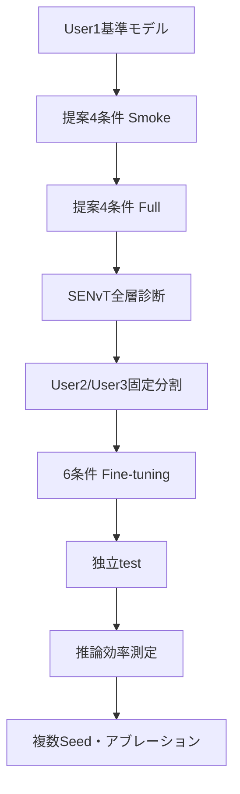

# SHL-2023 TGEC実験ロードマップ

> **更新日：2026-09-12**  
> patch size 16、保持パッチ数16の条件について、**全6条件・Seed 0／1／2のUser1学習、User2/User3 Fine-tuning、および独立testが完了**している。  
> GPU・CPU上の推論効率も測定済みであり、最終結果は`experiments/shl2023_senvt_kd/results/`へ集約する。

## 1. この文書の目的

本書は、SENvT-Bを教師、PatchEchoClassifier（PRC）を生徒とするSHL-2023実験について、データ準備、User1での蒸留、提案手法TGEC、User2/User3でのFine-tuning、独立test、効率測定までの正式な実行順をまとめたものである。

今回の主実験では、元論文の実験構成に合わせて次の流れを採用する。

```text
SHL-2023 User1
  ├─ SENvT-B教師のFine-tuning
  ├─ PRC基準モデルの学習
  └─ APS / TG-Skip / TGECの学習・蒸留
                  ↓
SHL-2023 User2/User3
  ├─ 22,985窓：Fine-tuning
  ├─  2,873窓：Fine-tuning中のモデル選択
  └─  2,874窓：独立した最終test
```

PAMAP2など別データセットへの転移学習は行わない。User1で学習したモデルをUser2/User3へ直接適用するzero-shot評価も、主結果には使用しない。

すべてのコマンドは、特に記載がない限り次の場所で実行する。

```bash
cd "/home/jovyan/work/srv11/蒸留/EchoClassifier"
```

---

## 2. 研究の中心仮説

提案手法の中心は、重要度が低いパッチを単に削除することではない。

> SENvTが持つ時間方向の判断情報を使って重要パッチを選び、選ばれなかったパッチも1個の要約トークンへ凝縮してPRCへ渡すことで、PRCの逐次処理回数を削減しながら分類に必要な情報を保持できるか。

入力を

$$
X \in \mathbb{R}^{B \times 3 \times 496}
$$

とする。patch sizeとstrideを16にすると、PRCへ入る時間パッチ数は

$$
N = \frac{496-16}{16}+1 = 31
$$

となる。

TGECは31パッチから16パッチを選択し、残り15パッチを1個の要約トークンへ変換する。そのためPRCが処理する時間トークンは、通常PRCの31個に対して17個となる。

| 条件 | パッチ選択 | PRCへの入力 | 省略パッチ | User1での損失 |
|---|---|---:|---|---|
| PRC-CE | なし | 31 | なし | CE |
| PRC-KD | なし | 31 | なし | CE + logit KD |
| APS-CE | 生徒APS | 16 | 破棄 | CE |
| APS-KD | 生徒APS | 16 | 破棄 | CE + logit KD |
| TG-Skip | SENvT layer 1で教師誘導 | 16 | 破棄 | CE + logit KD + route KL |
| TGEC | SENvT layer 1で教師誘導 | 16 + 要約1 | 1トークンへ凝縮 | CE + logit KD + route KL + content loss |

最重要比較は`TG-Skip`と`TGEC`である。両者は教師、選択パッチ数、PRC構造を揃え、選ばれなかった15パッチを「捨てるか」「1トークンへ凝縮するか」だけを変える。

---

## 3. 学習損失

### 3.1 分類損失

正解ラベルを $y$、生徒の分類確率を $p_S$ とすると、分類損失は次式である。

```math
\mathcal{L}_{\mathrm{CE}}
=
-\sum_{c=1}^{C} y_c \log p_{S,c}
```

### 3.2 通常のlogit蒸留

教師と生徒のlogitをそれぞれ $`z_T`$、$`z_S`$、蒸留温度を $`T_d`$ とすると、logit蒸留損失は次式である。

```math
\mathcal{L}_{\mathrm{KD}}
=
T_d^2
D_{\mathrm{KL}}
\left(
\mathrm{softmax}\left(\frac{z_T}{T_d}\right)
\,\middle\|\,
\mathrm{softmax}\left(\frac{z_S}{T_d}\right)
\right)
```

本実験では $\alpha=0.7$、$`T_d=2.5`$ を使用する。

### 3.3 教師誘導パッチ選択

SENvTのencoder layer $\ell$ において、CLSから時刻 $`t`$ へのAttentionとValueの寄与を次式で定義する。

```math
g_t^{(\ell)}
=
W_O^{(\ell)}
\left[
a_{\mathrm{CLS},t}^{(\ell,1)}v_t^{(\ell,1)};
\ldots;
a_{\mathrm{CLS},t}^{(\ell,H)}v_t^{(\ell,H)}
\right]
```

生徒のパッチ $`i`$ に対応する16時刻の集合を $`P_i`$ とし、時間位置ごとの寄与を集約する。

```math
G_i^{(\ell)}
=
\sum_{t\in P_i} g_t^{(\ell)}
```

教師のパッチ重要度分布 $`q^{(\ell)}`$ を次式で求める。

```math
q_i^{(\ell)}
=
\frac{\left\|G_i^{(\ell)}\right\|_2}
{\sum_{j=1}^{31}\left\|G_j^{(\ell)}\right\|_2}
```

生徒routerが出力するスコアを $`s_i`$、温度を $`T_s`$ とすると、生徒のパッチ分布は次式となる。

```math
p_i
=
\frac{\exp(s_i/T_s)}
{\sum_{j=1}^{31}\exp(s_j/T_s)}
```

教師分布 $`q`$ を生徒分布 $`p`$ へ蒸留するため、経路蒸留損失を次式で定義する。

```math
\mathcal{L}_{\mathrm{route}}
=
D_{\mathrm{KL}}\left(q\,\middle\|\,p\right)
```

### 3.4 省略情報の凝縮

選択されなかったパッチの集合を $\mathcal{O}$、パッチ埋め込みを $e_i\in\mathbb{R}^{16}$ とする。省略パッチの平均とRMSを次式で求める。

```math
\mu_{\mathcal{O}}
=
\frac{1}{|\mathcal{O}|}
\sum_{i\in\mathcal{O}}e_i
```

```math
\rho_{\mathcal{O}}
=
\sqrt{
\frac{1}{|\mathcal{O}|}
\sum_{i\in\mathcal{O}}e_i^{\odot 2}
+\varepsilon
}
```

平均とRMSをMLPへ入力し、一つの要約トークンを生成する。

```math
z_{\mathrm{sum}}
=
g_{\phi}
\left(
[\mu_{\mathcal{O}};\rho_{\mathcal{O}}]
\right)
\in\mathbb{R}^{16}
```

教師側の省略パッチ情報を固定射影した目標を $\widetilde{G}_{\mathcal{O}}$ とすると、内容損失は次式となる。

```math
\mathcal{L}_{\mathrm{content}}
=
1-
\cos\left(
z_{\mathrm{sum}},
\widetilde{G}_{\mathcal{O}}
\right)
```

### 3.5 全損失

TGECのUser~1学習時の全損失は次式である。

```math
\mathcal{L}
=
(1-\alpha)\mathcal{L}_{\mathrm{CE}}
+\alpha\mathcal{L}_{\mathrm{KD}}
+\lambda_{\mathrm{route}}\mathcal{L}_{\mathrm{route}}
+\lambda_{\mathrm{content}}\mathcal{L}_{\mathrm{content}}
```

現在の設定は次のとおりである。

```text
alpha          = 0.7
KD temperature = 2.5
route weight   = 1.0
content weight = 1.0
keep ratio     = 0.5
teacher layer  = 1（0始まり）
```

User2/User3でのdownstream Fine-tuningでは教師SENvTを使用せず、各User1学習済みチェックポイントを初期値として分類損失で更新する。

---

## 4. 使用するスクリプト

| ファイル | 役割 | 正式手順 |
|---|---|---|
| `00_finetune_teacher_senvtB.sh` | SENvT-B教師のFine-tuning | 完了済み |
| `10_distill_standard_students.sh` | PRCなどへの通常logit KD | 完了確認用 |
| `11_prepare_shl2023_user23.sh` | User2/User3 raw dataの窓化 | 必須・1回 |
| `14_train_prc_ce.sh` | 蒸留なしPRC-CEのUser1学習 | 必須 |
| `20_run_prc_condensation_study.sh` | APS-CE、APS-KD、TG-Skip、TGECのUser1学習 | **現在実行中** |
| `20b_analyze_senvt_layers.sh` | SENvT全12層を比較しLayer 1の根拠図を作る | Step 6後 |
| `16_prepare_user23_downstream_split.sh` | User2/User3をtrain/val/testへ固定分割 | 必須・1回 |
| `17_finetune_checkpoint_user23.sh` | 任意チェックポイントのFine-tuning共通処理 | 補助SH |
| `18_finetune_prc_baselines_user23.sh` | PRC-CE、PRC-KDのFine-tuning | 必須 |
| `23_finetune_prc_study_user23.sh` | 提案関連4条件のFine-tuning | 必須 |
| `24_eval_finetuned_models_user23_test.sh` | Fine-tuning済み6条件の独立test | 必須 |
| `25_run_additional_prc_experiments.sh` | 全6条件のSeed 1・2におけるUser1学習、Fine-tuning、独立test | 完了済み |
| `27_profile_and_collect_prc_results.sh` | GPU・CPU効率測定と分類結果の集約 | 必須 |
| `profile_prc_models_v2.py` | FLOPs、Latency、Throughput、メモリ、Footprintの測定 | `27`から呼び出す |
| `collect_prc_results.py` | Seed別結果と3 Seed統計のCSV・Markdown出力 | `27`から呼び出す |
| `12_eval_checkpoint_user23.sh` | User2/User3全体への直接評価 | 任意・zero-shotのみ |
| `13_eval_standard_kd_user23.sh` | 標準KDモデルのzero-shot一括評価 | 任意 |
| `15_eval_prc_ce_user23.sh` | PRC-CEのzero-shot評価 | 任意 |
| `21_eval_prc_study_user23.sh` | 提案条件のzero-shot評価 | 任意 |

---

## 5. 正式な実験順序



zero-shot評価はこの正式フローに含めない。

---

## 6. Step 0〜Step 5：現在までの工程

### Step 0：コード検査

```bash
python -m py_compile \
  main.py \
  engine.py \
  loss_func.py \
  datasets.py \
  models/TeacherGuidedEvidenceCondensation.py \
  models/senvt_adapters.py

bash -n scripts/shl2023_senvt_kd/*.sh

python scripts/shl2023_senvt_kd/00_smoke_test_tgec.py
```

### Step 1：標準KDの完了確認

```bash
find experiments/shl2023_senvt_kd/student_distillation/standard_kd \
  -maxdepth 2 \
  -name summary.json \
  -print
```

最低限、PRC-KDについて次が必要である。

```text
experiments/shl2023_senvt_kd/student_distillation/standard_kd/PRC_seed0/best_checkpoint.pth
experiments/shl2023_senvt_kd/student_distillation/standard_kd/PRC_seed0/summary.json
```

### Step 2：User2/User3データの前処理

```bash
bash scripts/shl2023_senvt_kd/11_prepare_shl2023_user23.sh
```

入力：

```text
dataset/SHL_2023/validate/Hips/Acc.txt
dataset/SHL_2023/validate/Hips/Label.txt
```

出力：

```text
dataset/2023_processed_user23/100hz_5.0s_overlap0.0s/Hips_Acc.npy
dataset/2023_processed_user23/100hz_5.0s_overlap0.0s/Hips_Label.npy
```

### Step 3：PRC-CEのUser1学習

```bash
bash scripts/shl2023_senvt_kd/14_train_prc_ce.sh smoke
bash scripts/shl2023_senvt_kd/14_train_prc_ce.sh full
```

### Step 4：提案モデルの接続確認

```bash
python scripts/shl2023_senvt_kd/00_smoke_test_tgec.py
```

### Step 5：提案関連4条件のSmoke

```bash
bash scripts/shl2023_senvt_kd/20_run_prc_condensation_study.sh smoke all
```

確認事項：

- APS、TG-Skipは16パッチを処理する
- TGECは16パッチ＋要約1トークンを処理する
- TG-SkipとTGECでroute lossが記録される
- TGECでのみcontent lossが記録される
- NaN、Inf、CUDA OOMが発生しない

---

## 7. Step 6：提案関連4条件をUser1でFull学習する

Seed 0の初期実験では次のコマンドを使用した。

```bash
bash scripts/shl2023_senvt_kd/20_run_prc_condensation_study.sh full all
```

実行順：

```text
APS-CE → APS-KD → TG-Skip → TGEC
```

出力：

```text
experiments/shl2023_senvt_kd/student_distillation/prc_condensation/
├── aps_ce_seed0/
├── aps_kd_seed0/
├── tg_skip_seed0/
└── tgec_seed0/
```

各条件の正常完了は`summary.json`の存在で判定する。

```bash
find experiments/shl2023_senvt_kd/student_distillation/prc_condensation \
  -mindepth 2 \
  -maxdepth 2 \
  -name summary.json \
  -print
```

途中停止した場合：

```bash
RESUME_PARTIAL=1 \
bash scripts/shl2023_senvt_kd/20_run_prc_condensation_study.sh full all
```

`FORCE=1`は既存結果を上書きするため、通常は使用しない。

---

## 8. Step 7：SENvTのLayer 1を選んだ根拠を解析する

Step 6が完全に終了し、`main.py`の学習プロセスが存在しないことを確認してから実行する。

```bash
ps -u "$USER" -o pid,etime,cmd \
  | grep main.py \
  | grep -v grep
```

何も表示されなければ実行する。

```bash
bash scripts/shl2023_senvt_kd/20b_analyze_senvt_layers.sh
```

### 8.1 解析指標

SENvTの各encoder layerから教師のパッチ重要度分布を取得し、パッチ間の重要度の偏りを比較する。  
Encoder layerを $\ell$、layer $\ell$ における31パッチの教師重要度分布を $\mathbf{q}^{(\ell)}$ とする。

はじめに、重要度が高い上位16パッチに含まれる重要度の合計をTop-16 massとして計算する。

```math
M_{16}^{(\ell)}
=
\sum_{
i\in\mathrm{Top16}
\left(\mathbf{q}^{(\ell)}\right)
}
q_i^{(\ell)}
```

ここで、$`\mathrm{Top16}(\mathbf{q}^{(\ell)})`$ は、layer $`\ell`$ の教師重要度が高い上位16パッチのインデックス集合を表す。  
$`M_{16}^{(\ell)}`$ が大きいほど、教師の重要度が少数のパッチに集中しており、上位16パッチの選択によって教師が重視する情報を保持しやすい。

31パッチの重要度が完全に一様である場合、上位16パッチの重要度の合計は次の値となる。

```math
M_{16}^{\mathrm{uniform}}
=
\frac{16}{31}
\approx 0.516
```

したがって、$`M_{16}^{(\ell)}`$ が0.516に近い場合、そのlayerの重要度分布は一様分布に近い。  
一方、0.516を大きく上回る場合は、特定のパッチに重要度が集中していることを示す。

重要度分布全体の一様性を評価するため、正規化エントロピーも計算する。

```math
H_{\mathrm{norm}}^{(\ell)}
=
-\frac{1}{\log 31}
\sum_{i=1}^{31}
q_i^{(\ell)}
\log q_i^{(\ell)}
```

正規化エントロピー$`H_{\mathrm{norm}}^{(\ell)}`$は0から1の範囲を取る。  
値が1に近いほど、31パッチの重要度が一様であり、パッチ間の差が小さい。  
値が小さいほど、重要度が一部のパッチに集中している。

Teacher layerの選択では、主に次の点を確認する。

1. Top-16 mass $`M_{16}^{(\ell)}`$ が一様分布の基準値0.516を十分に上回るか。
2. 正規化エントロピー$`H_{\mathrm{norm}}^{(\ell)}`$が後段layerと比較して低いか。
3. サンプル間で同様の傾向が確認できるか。
4. 特定の少数サンプルだけによって平均値が高くなっていないか。
5. 選択されたパッチが入力信号の時間的な特徴と対応しているか。

Top-16 massが大きく、正規化エントロピーが低いlayerは、重要パッチとそれ以外のパッチを区別しやすいため、パッチ選択の教師信号として適している。  
一方、正規化エントロピーが1に近いlayerでは重要度がほぼ一様であり、上位パッチを選択するための教師信号として弱い。

### 8.2 出力

```text
experiments/shl2023_senvt_kd/results/layer_selection/
├── 01_layer_selection.png
├── 01_layer_selection.pdf
├── 02_layer_patch_heatmap.png
├── 02_layer_patch_heatmap.pdf
├── 03_sample_layer_heatmap.png
├── 03_sample_layer_heatmap.pdf
├── senvt_layer_metrics.csv
├── senvt_layer_diagnostics.json
├── senvt_layer_sample_metrics.npz
└── analysis_stdout.log
```

論文本文では`01_layer_selection.pdf`を第一候補とする。Layer 1が最大のTop-16 massを持ち、後段層のような時間トークン表現の均一化が起きる前であることを確認する。

```bash
python - <<'PY'
import json

path = (
    "experiments/shl2023_senvt_kd/results/"
    "layer_selection/senvt_layer_diagnostics.json"
)

with open(path, encoding="utf-8") as file:
    result = json.load(file)

print("configured:", result["configured_tgec_layer"])
print("empirical best:", result["empirical_best_layer_by_mean_topk_mass"])
print("matches:", result["configured_layer_matches_empirical_best"])
PY
```

`matches: True`ならLayer 1採用の定量的根拠として使用できる。`False`の場合は結果を隠さず、Layer 0・1・2のアブレーションを追加して判断する。

---

## 9. Step 8：User2/User3をFine-tuning・validation・testへ固定分割する

まだUser2/User3の前処理を行っていない場合は、先に実行する。

```bash
bash scripts/shl2023_senvt_kd/11_prepare_shl2023_user23.sh
```

続いて固定分割を作る。

```bash
bash scripts/shl2023_senvt_kd/16_prepare_user23_downstream_split.sh
```

出力：

```text
experiments/shl2023_senvt_kd/data_splits/
├── shl2023_user23_downstream_split_indices.npz
└── shl2023_user23_downstream_split_indices.json
```

期待する窓数：

| 用途 | 窓数 | 使用方法 |
|---|---:|---|
| Fine-tuning train | 22,985 | パラメータ更新 |
| Fine-tuning validation | 2,873 | best checkpoint選択 |
| Held-out test | 2,874 | 最終評価のみ |

分割ファイルは全条件で共通使用し、作り直さない。特にtest indicesを学習、ハイパーパラメータ選択、early stoppingへ使用しない。

---

## 10. Step 9：PRC基準2条件をUser2/User3でFine-tuningする

対象：

1. PRC-CE
2. PRC-KD

### Smoke

```bash
bash scripts/shl2023_senvt_kd/18_finetune_prc_baselines_user23.sh smoke
```

### Full

```bash
bash scripts/shl2023_senvt_kd/18_finetune_prc_baselines_user23.sh full
```

途中再開：

```bash
RESUME_PARTIAL=1 \
bash scripts/shl2023_senvt_kd/18_finetune_prc_baselines_user23.sh full
```

出力：

```text
experiments/shl2023_senvt_kd/student_finetune/user23/
├── PRC_ce_seed0/
├── prc_ce_seed{1,2}/
├── PRC_kd_seed0/
└── prc_kd_seed{1,2}/
```

ここでは教師SENvTを再び使って蒸留するのではない。User1で学習したチェックポイントを初期値として、User2/User3の22,985窓で分類Fine-tuningする。

---

## 11. Step 10：提案関連4条件をUser2/User3でFine-tuningする

対象：

1. APS-CE
2. APS-KD
3. TG-Skip
4. TGEC

### Smoke

```bash
bash scripts/shl2023_senvt_kd/23_finetune_prc_study_user23.sh smoke
```

### Full

```bash
bash scripts/shl2023_senvt_kd/23_finetune_prc_study_user23.sh full
```

途中再開：

```bash
RESUME_PARTIAL=1 \
bash scripts/shl2023_senvt_kd/23_finetune_prc_study_user23.sh full
```

出力：

```text
experiments/shl2023_senvt_kd/student_finetune/user23/
├── aps_ce_seed{0,1,2}/
├── aps_kd_seed{0,1,2}/
├── tg_skip_seed{0,1,2}/
└── tgec_seed{0,1,2}/
```

TG-SkipとTGECのrouterおよびsummary encoderはUser1蒸留で得たパラメータを初期値として引き継ぐ。User2/User3 Fine-tuning中は教師SENvTを使わず、`distillation-type none`で学習する。

---

## 12. Step 11：Fine-tuning済み6条件を独立testで最終評価する

```bash
bash scripts/shl2023_senvt_kd/24_eval_finetuned_models_user23_test.sh
```

対象：

```text
PRC-CE
PRC-KD
APS-CE
APS-KD
TG-Skip
TGEC
```

出力：

```text
experiments/shl2023_senvt_kd/heldout_evaluation/user23_test/
├── PRC_ce_seed0/
├── prc_ce_seed{1,2}/
├── PRC_kd_seed0/
├── prc_kd_seed{1,2}/
├── aps_ce_seed{0,1,2}/
├── aps_kd_seed{0,1,2}/
├── tg_skip_seed{0,1,2}/
└── tgec_seed{0,1,2}/
```

論文の主精度表には、この独立testのAccuracy、Macro Precision、Macro Recall、Macro F1を使用する。User1 validation精度やFine-tuning validation精度を最終test精度として扱わない。

### 見るべき比較

| 比較 | 検証内容 |
|---|---|
| PRC-CE vs PRC-KD | User1で行った通常KDの効果 |
| PRC-KD vs APS-KD | 31パッチから16パッチへ減らす影響 |
| APS-CE vs APS-KD | APSに通常KDを加える効果 |
| APS-KD vs TG-Skip | 教師誘導route学習の効果 |
| TG-Skip vs TGEC | 省略パッチを破棄せず凝縮する効果 |
| PRC-KD vs TGEC | フルパッチPRCに対する精度維持と効率改善 |

---

## 13. 最終評価結果の保存先と集約

主実験の条件は、入力長496、patch size 16、31パッチ中16パッチ保持で固定する。比較する6条件は次のとおりであり、すべてSeed 0、1、2で評価する。

```text
PRC-CE
PRC-KD
APS-CE
APS-KD
TG-Skip
TGEC
```

### 13.1 Seedごとの分類結果

独立testの各結果は次の場所に保存される。

```text
experiments/shl2023_senvt_kd/heldout_evaluation/user23_test/
└── <tag>/
    └── evaluation_summary.json
```

`<tag>`は各実験の出力ディレクトリ名である。PRC系は既存構成を引き継いでおり、Seed 0が`PRC_ce_seed0`、`PRC_kd_seed0`、Seed 1・2が`prc_ce_seed1`、`prc_ce_seed2`、`prc_kd_seed1`、`prc_kd_seed2`である。ほかの条件は`aps_ce_seedN`、`aps_kd_seedN`、`tg_skip_seedN`、`tgec_seedN`となる。  
論文の分類性能には、この`evaluation_summary.json`に記録されたAccuracy、Macro Precision、Macro Recall、Macro F1を用いる。

User1学習とUser2/User3 Fine-tuningの途中結果は、それぞれ次に保存される。

```text
experiments/shl2023_senvt_kd/student_baseline/
experiments/shl2023_senvt_kd/student_distillation/
experiments/shl2023_senvt_kd/student_finetune/user23/
```

これらのvalidation値はモデル選択や学習確認に用い、独立testの値とは区別する。

### 13.2 GPU・CPU推論効率

学習プロセスが動いていない状態で、次を実行する。

```bash
cd "/home/jovyan/work/srv11/蒸留/EchoClassifier"

PROFILE_WARMUP=20 PROFILE_REPEATS=200 PROFILE_CPU_THREADS=1 \
bash scripts/shl2023_senvt_kd/27_profile_and_collect_prc_results.sh
```

最終的な効率測定結果は次に保存される。

```text
experiments/shl2023_senvt_kd/results/
├── prc_efficiency_ps16_k16_gpu.json
└── prc_efficiency_ps16_k16_cpu.json
```

両JSONには、モデル状態容量（Footprint）、実行FLOPs、Latencyの平均・中央値・標準偏差、Throughput、Reservoir更新トークン数、および推定支配的MACsが保存される。GPU版にはピークGPUメモリも含まれる。Footprintには`model_state_size_mb`、実行FLOPsには`profiled_mflops_per_sample`、Latencyには`latency_ms_median`を使用する。

効率値は学習Seedごとの評価値ではない。同一モデルを同一環境で反復実行して得たプロファイル値として、3 Seedの分類性能とは分けて報告する。

### 13.3 集約後の表

`27_profile_and_collect_prc_results.sh`は効率測定後に`collect_prc_results.py`を実行し、次の3ファイルを生成する。

```text
experiments/shl2023_senvt_kd/results/
├── prc_combined_results.csv
├── prc_seed_summary.csv
└── prc_seed_summary.md
```

| ファイル | 内容 |
|---|---|
| `prc_combined_results.csv` | 6条件×3 Seedの分類結果と効率指標をSeed単位で統合 |
| `prc_seed_summary.csv` | Accuracy、Macro Precision、Macro Recall、Macro F1の平均と標本標準偏差 |
| `prc_seed_summary.md` | 論文表へ転記しやすいMarkdown形式の要約 |

効率測定をやり直さず、既存JSONから分類結果だけ再集約する場合は次を実行する。

```bash
python scripts/shl2023_senvt_kd/collect_prc_results.py \
  --experiment-root experiments/shl2023_senvt_kd \
  --output-dir experiments/shl2023_senvt_kd/results
```

論文へ転記する際は、Accuracy、Macro Precision、Macro Recall、Macro F1を3 Seedの「平均 ± 標本標準偏差」で示す。Latency、Throughput、FLOPs、Footprint、およびピークメモリは、上記GPU・CPUプロファイルの測定条件を併記する。

---

## 14. zero-shot評価の扱い

User1で学習したモデルをFine-tuningせずUser2/User3へ直接適用するzero-shot評価は、正式な実行手順には含めない。

zero-shotが測るのは、主に利用者間の分布変化に対する一般化性能である。一方、TGECの中心仮説は、省略パッチの情報凝縮による精度・効率の両立である。zero-shot精度が低い場合、情報凝縮の問題と利用者差の問題を分離しにくい。

時間に余裕があり、補助結果としてcross-user generalizationを報告したい場合だけ、次を実行する。

```bash
# PRC-CEのzero-shot
bash scripts/shl2023_senvt_kd/15_eval_prc_ce_user23.sh

# PRC-KDのzero-shot
bash scripts/shl2023_senvt_kd/13_eval_standard_kd_user23.sh PRC

# 提案関連条件のzero-shot
bash scripts/shl2023_senvt_kd/21_eval_prc_study_user23.sh
```

これらの出力は補助解析として

```text
experiments/shl2023_senvt_kd/heldout_evaluation/user23_mixed/
```

へ保存する。主結果表には`user23_test/`のFine-tuning後の結果を使用する。

---

## 15. 最終的な結果フォルダ

```text
experiments/shl2023_senvt_kd/
├── student_finetune/user23/
│   ├── PRC_ce_seed0/
│   ├── prc_ce_seed{1,2}/
│   ├── PRC_kd_seed0/
│   ├── prc_kd_seed{1,2}/
│   ├── aps_ce_seed{0,1,2}/
│   ├── aps_kd_seed{0,1,2}/
│   ├── tg_skip_seed{0,1,2}/
│   └── tgec_seed{0,1,2}/
│
├── heldout_evaluation/user23_test/
│   ├── PRC_ce_seed0/evaluation_summary.json
│   ├── prc_ce_seed{1,2}/evaluation_summary.json
│   ├── PRC_kd_seed0/evaluation_summary.json
│   ├── prc_kd_seed{1,2}/evaluation_summary.json
│   ├── aps_ce_seed{0,1,2}/evaluation_summary.json
│   ├── aps_kd_seed{0,1,2}/evaluation_summary.json
│   ├── tg_skip_seed{0,1,2}/evaluation_summary.json
│   └── tgec_seed{0,1,2}/evaluation_summary.json
│
└── results/
    ├── layer_selection/
    ├── prc_efficiency_ps16_k16_gpu.json
    ├── prc_efficiency_ps16_k16_cpu.json
    ├── prc_combined_results.csv
    ├── prc_seed_summary.csv
    └── prc_seed_summary.md
```

各学習フォルダでは、`summary.json`があれば学習完了、`checkpoint.pth`だけがあり`summary.json`がなければ途中停止と判定する。独立testは`evaluation_summary.json`の存在で完了を判定する。

---

## 16. 最終確認

6条件×3 Seedの独立testが揃っているかを確認する。

```bash
find experiments/shl2023_senvt_kd/heldout_evaluation/user23_test \
  -mindepth 2 -maxdepth 2 -name evaluation_summary.json \
  | sort

find experiments/shl2023_senvt_kd/heldout_evaluation/user23_test \
  -mindepth 2 -maxdepth 2 -name evaluation_summary.json \
  | wc -l
```

Smoke結果や補助ディレクトリを含まなければ、2番目のコマンドは`18`を返す。続いて、最終集約ファイルを確認する。

```bash
ls -lh experiments/shl2023_senvt_kd/results/{\
prc_efficiency_ps16_k16_gpu.json,\
prc_efficiency_ps16_k16_cpu.json,\
prc_combined_results.csv,\
prc_seed_summary.csv,\
prc_seed_summary.md}
```

論文の主結果は`prc_seed_summary.csv`とGPU・CPUの効率JSONから作成し、必要に応じて`prc_combined_results.csv`で各Seedの値を確認する。

---

## 17. 論文で最低限使用する結果

1. **分類性能**：全6条件について、User2/User3独立testの3 Seed平均と標本標準偏差を報告する。
2. **凝縮の有効性**：TGECとTG-Skipを比較する。
3. **教師誘導の有効性**：TG-SkipとAPS-KDを比較する。
4. **効率**：PRC-KD、APS-KD、TG-Skip、TGECについて、GPU・CPU Latency、Throughput、FLOPs、Footprint、および更新トークン数を比較する。
5. **Layer選択根拠**：全12層の解析結果から、教師信号に第2エンコーダ層（実装上の`teacher_layer=1`）を用いる根拠を示す。

主設定はpatch size 16、31パッチ中16パッチ保持とする。

