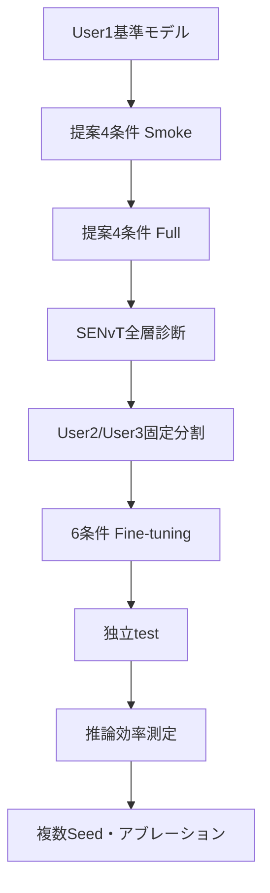

# SHL-2023 TGEC実験ロードマップ

> **更新日：2026-09-06**  
> 現在は **Step 6：提案関連4条件のUser1 Full学習** を実行中である。  
> User2/User3へのzero-shot評価は正式手順から外し、任意の補助解析へ移した。

## 1. この文書の目的

本書は、SENvT-Bを教師、PatchEchoClassifier（PRC）を生徒とするSHL-2023実験について、データ準備、User1での蒸留、提案手法TGEC、User2/User3でのFine-tuning、独立test、効率測定までの正式な実行順をまとめたものである。

今回の主実験では、元論文の実験構成に合わせて次の流れを採用する。

```text
SHL-2023 User1
  ├─ SENvT-B教師のFine-tuning
  ├─ PRC基準モデルの学習
  └─ APS / TG-Skip / TGECの学習・蒸留
                  ↓
SHL-2023 User2/User3
  ├─ 22,985窓：Fine-tuning
  ├─  2,873窓：Fine-tuning中のモデル選択
  └─  2,874窓：独立した最終test
```

PAMAP2など別データセットへの転移学習は行わない。User1で学習したモデルをUser2/User3へ直接適用するzero-shot評価も、主結果には使用しない。

すべてのコマンドは、特に記載がない限り次の場所で実行する。

```bash
cd "/home/jovyan/work/srv11/蒸留/EchoClassifier"
```

---

## 2. 研究の中心仮説

提案手法の中心は、重要度が低いパッチを単に削除することではない。

> SENvTが持つ時間方向の判断情報を使って重要パッチを選び、選ばれなかったパッチも1個の要約トークンへ凝縮してPRCへ渡すことで、PRCの逐次処理回数を削減しながら分類に必要な情報を保持できるか。

入力を

$$
X \in \mathbb{R}^{B \times 3 \times 496}
$$

とする。patch sizeとstrideを16にすると、PRCへ入る時間パッチ数は

$$
N = \frac{496-16}{16}+1 = 31
$$

となる。

TGECは31パッチから16パッチを選択し、残り15パッチを1個の要約トークンへ変換する。そのためPRCが処理する時間トークンは、通常PRCの31個に対して17個となる。

| 条件 | パッチ選択 | PRCへの入力 | 省略パッチ | User1での損失 |
|---|---|---:|---|---|
| PRC-CE | なし | 31 | なし | CE |
| PRC-KD | なし | 31 | なし | CE + logit KD |
| APS-CE | 生徒APS | 16 | 破棄 | CE |
| APS-KD | 生徒APS | 16 | 破棄 | CE + logit KD |
| TG-Skip | SENvT layer 1で教師誘導 | 16 | 破棄 | CE + logit KD + route KL |
| TGEC | SENvT layer 1で教師誘導 | 16 + 要約1 | 1トークンへ凝縮 | CE + logit KD + route KL + content loss |

最重要比較は`TG-Skip`と`TGEC`である。両者は教師、選択パッチ数、PRC構造を揃え、選ばれなかった15パッチを「捨てるか」「1トークンへ凝縮するか」だけを変える。

---

## 3. 学習損失

### 3.1 分類損失

正解ラベルを$y$、生徒の分類確率を$p_S$とすると、分類損失は次式である。

$$
\mathcal{L}_{\mathrm{CE}}
=
-\sum_{c=1}^{C} y_c \log p_{S,c}
$$

### 3.2 通常のlogit蒸留

教師と生徒のlogitをそれぞれ$z_T,z_S$、蒸留温度を$T_d$とすると、logit蒸留損失は次式である。

$$
\mathcal{L}_{\mathrm{KD}}
=
T_d^2
D_{\mathrm{KL}}
\left(
\operatorname{softmax}\left(\frac{z_T}{T_d}\right)
\;\middle\|\;
\operatorname{softmax}\left(\frac{z_S}{T_d}\right)
\right)
$$

本実験では$α=0.7$、$T_d=2.5$を使用する。

### 3.3 教師誘導パッチ選択

SENvTのencoder layer $\ell$において、CLSから時刻$t$へのAttention×Value寄与を次のように定義する。

$$
g_t^{(\ell)}
=
W_O^{(\ell)}
\left[
a_{\mathrm{CLS},t}^{(\ell,1)}v_t^{(\ell,1)};
\ldots;
a_{\mathrm{CLS},t}^{(\ell,H)}v_t^{(\ell,H)}
\right]
$$

生徒のパッチ$i$に対応する16時刻を$P_i$とし、時間寄与を集約する。

$$
G_i^{(\ell)}
=
\sum_{t\in P_i} g_t^{(\ell)}
$$

教師のパッチ重要度分布$q^{(\ell)}$は次式で求める。

$$
q_i^{(\ell)}
=
\frac{\left\|G_i^{(\ell)}\right\|_2}
{\sum_{j=1}^{31}\left\|G_j^{(\ell)}\right\|_2}
$$

生徒routerが出力するscoreを$s_i$、温度を$T_s$とすると、生徒のパッチ分布は

$$
p_i
=
\frac{\exp(s_i/T_s)}
{\sum_{j=1}^{31}\exp(s_j/T_s)}
$$

である。教師の分布$q$を生徒の分布$p$へ蒸留する。

$$
\mathcal{L}_{\mathrm{route}}
=
D_{\mathrm{KL}}(q\|p)
$$

### 3.4 省略情報の凝縮

選択されなかったパッチ集合を$O$、パッチ埋め込みを$e_i\in\mathbb{R}^{16}$とする。省略パッチの平均とRMSを求める。

$$
\mu_O
=
\frac{1}{|O|}
\sum_{i\in O}e_i
$$

$$
\rho_O
=
\sqrt{
\frac{1}{|O|}
\sum_{i\in O}e_i^{\odot 2}
+\varepsilon
}
$$

平均とRMSをMLPへ入力し、1個の要約トークンを生成する。

$$
z_{\mathrm{sum}}
=
g_{\phi}([\mu_O;\rho_O])
\in\mathbb{R}^{16}
$$

教師側の省略パッチ情報を固定射影した目標を$\widetilde{G}_O$とすると、内容損失は次式である。

$$
\mathcal{L}_{\mathrm{content}}
=
1-
\cos\left(z_{\mathrm{sum}},\widetilde{G}_O\right)
$$

### 3.5 全損失

TGECのUser1学習時の全損失は次式である。

$$
\mathcal{L}
=
(1-\alpha)\mathcal{L}_{\mathrm{CE}}
+\alpha\mathcal{L}_{\mathrm{KD}}
+\lambda_{\mathrm{route}}\mathcal{L}_{\mathrm{route}}
+\lambda_{\mathrm{content}}\mathcal{L}_{\mathrm{content}}
$$

現在の設定は次のとおりである。

```text
alpha          = 0.7
KD temperature = 2.5
route weight   = 1.0
content weight = 1.0
keep ratio     = 0.5
teacher layer  = 1（0始まり）
```

User2/User3でのdownstream Fine-tuningでは教師SENvTを使用せず、各User1学習済みチェックポイントを初期値として分類損失で更新する。

---

## 4. 使用するスクリプト

| ファイル | 役割 | 正式手順 |
|---|---|---|
| `00_finetune_teacher_senvtB.sh` | SENvT-B教師のFine-tuning | 完了済み |
| `10_distill_standard_students.sh` | PRCなどへの通常logit KD | 完了確認用 |
| `11_prepare_shl2023_user23.sh` | User2/User3 raw dataの窓化 | 必須・1回 |
| `14_train_prc_ce.sh` | 蒸留なしPRC-CEのUser1学習 | 必須 |
| `20_run_prc_condensation_study.sh` | APS-CE、APS-KD、TG-Skip、TGECのUser1学習 | **現在実行中** |
| `20b_analyze_senvt_layers.sh` | SENvT全12層を比較しLayer 1の根拠図を作る | Step 6後 |
| `16_prepare_user23_downstream_split.sh` | User2/User3をtrain/val/testへ固定分割 | 必須・1回 |
| `17_finetune_checkpoint_user23.sh` | 任意チェックポイントのFine-tuning共通処理 | 補助SH |
| `18_finetune_prc_baselines_user23.sh` | PRC-CE、PRC-KDのFine-tuning | 必須 |
| `23_finetune_prc_study_user23.sh` | 提案関連4条件のFine-tuning | 必須 |
| `24_eval_finetuned_models_user23_test.sh` | Fine-tuning済み6条件の独立test | 必須 |
| `22_profile_prc_study.sh` | パラメータ、Latency、メモリ、MACs測定 | 必須 |
| `12_eval_checkpoint_user23.sh` | User2/User3全体への直接評価 | 任意・zero-shotのみ |
| `13_eval_standard_kd_user23.sh` | 標準KDモデルのzero-shot一括評価 | 任意 |
| `15_eval_prc_ce_user23.sh` | PRC-CEのzero-shot評価 | 任意 |
| `21_eval_prc_study_user23.sh` | 提案条件のzero-shot評価 | 任意 |

---

## 5. 正式な実験順序



zero-shot評価はこの正式フローに含めない。

---

## 6. Step 0〜Step 5：現在までの工程

### Step 0：コード検査

```bash
python -m py_compile \
  main.py \
  engine.py \
  loss_func.py \
  datasets.py \
  models/TeacherGuidedEvidenceCondensation.py \
  models/senvt_adapters.py

bash -n scripts/shl2023_senvt_kd/*.sh

python scripts/shl2023_senvt_kd/00_smoke_test_tgec.py
```

### Step 1：標準KDの完了確認

```bash
find experiments/shl2023_senvt_kd/student_distillation/standard_kd \
  -maxdepth 2 \
  -name summary.json \
  -print
```

最低限、PRC-KDについて次が必要である。

```text
experiments/shl2023_senvt_kd/student_distillation/standard_kd/PRC_seed0/best_checkpoint.pth
experiments/shl2023_senvt_kd/student_distillation/standard_kd/PRC_seed0/summary.json
```

### Step 2：User2/User3データの前処理

```bash
bash scripts/shl2023_senvt_kd/11_prepare_shl2023_user23.sh
```

入力：

```text
dataset/SHL_2023/validate/Hips/Acc.txt
dataset/SHL_2023/validate/Hips/Label.txt
```

出力：

```text
dataset/2023_processed_user23/100hz_5.0s_overlap0.0s/Hips_Acc.npy
dataset/2023_processed_user23/100hz_5.0s_overlap0.0s/Hips_Label.npy
```

### Step 3：PRC-CEのUser1学習

```bash
bash scripts/shl2023_senvt_kd/14_train_prc_ce.sh smoke
bash scripts/shl2023_senvt_kd/14_train_prc_ce.sh full
```

### Step 4：提案モデルの接続確認

```bash
python scripts/shl2023_senvt_kd/00_smoke_test_tgec.py
```

### Step 5：提案関連4条件のSmoke

```bash
bash scripts/shl2023_senvt_kd/20_run_prc_condensation_study.sh smoke all
```

確認事項：

- APS、TG-Skipは16パッチを処理する
- TGECは16パッチ＋要約1トークンを処理する
- TG-SkipとTGECでroute lossが記録される
- TGECでのみcontent lossが記録される
- NaN、Inf、CUDA OOMが発生しない

---

## 7. Step 6：提案関連4条件をUser1でFull学習する【現在地】

現在実行しているコマンドは次である。

```bash
bash scripts/shl2023_senvt_kd/20_run_prc_condensation_study.sh full all
```

実行順：

```text
APS-CE → APS-KD → TG-Skip → TGEC
```

出力：

```text
experiments/shl2023_senvt_kd/student_distillation/prc_condensation/
├── aps_ce_seed0/
├── aps_kd_seed0/
├── tg_skip_seed0/
└── tgec_seed0/
```

各条件の正常完了は`summary.json`の存在で判定する。

```bash
find experiments/shl2023_senvt_kd/student_distillation/prc_condensation \
  -mindepth 2 \
  -maxdepth 2 \
  -name summary.json \
  -print
```

途中停止した場合：

```bash
RESUME_PARTIAL=1 \
bash scripts/shl2023_senvt_kd/20_run_prc_condensation_study.sh full all
```

`FORCE=1`は既存結果を上書きするため、通常は使用しない。

---

## 8. Step 7：SENvTのLayer 1を選んだ根拠を解析する

Step 6が完全に終了し、`main.py`の学習プロセスが存在しないことを確認してから実行する。

```bash
ps -u "$USER" -o pid,etime,cmd \
  | grep main.py \
  | grep -v grep
```

何も表示されなければ実行する。

```bash
bash scripts/shl2023_senvt_kd/20b_analyze_senvt_layers.sh
```

### 8.1 解析指標

各層$\ell$について、教師重要度$q^{(\ell)}$の上位16パッチが保持する情報量を測る。

$$
M_{16}^{(\ell)}
=
\sum_{i\in\mathrm{Top16}(q^{(\ell)})}
q_i^{(\ell)}
$$

一様分布の場合の基準は次のとおりである。

$$
M_{16}^{\mathrm{uniform}}
=
\frac{16}{31}
\approx 0.516
$$

正規化エントロピーも計算する。

$$
H_{\mathrm{norm}}^{(\ell)}
=
-\frac{1}{\log 31}
\sum_{i=1}^{31}
q_i^{(\ell)}\log q_i^{(\ell)}
$$

$H_{\mathrm{norm}}$が1に近いほど分布が一様で、パッチ選択の教師信号として弱い。

### 8.2 出力

```text
experiments/shl2023_senvt_kd/results/layer_selection/
├── 01_layer_selection.png
├── 01_layer_selection.pdf
├── 02_layer_patch_heatmap.png
├── 02_layer_patch_heatmap.pdf
├── 03_sample_layer_heatmap.png
├── 03_sample_layer_heatmap.pdf
├── senvt_layer_metrics.csv
├── senvt_layer_diagnostics.json
├── senvt_layer_sample_metrics.npz
└── analysis_stdout.log
```

論文本文では`01_layer_selection.pdf`を第一候補とする。Layer 1が最大のTop-16 massを持ち、後段層のような時間トークン表現の均一化が起きる前であることを確認する。

```bash
python - <<'PY'
import json

path = (
    "experiments/shl2023_senvt_kd/results/"
    "layer_selection/senvt_layer_diagnostics.json"
)

with open(path, encoding="utf-8") as file:
    result = json.load(file)

print("configured:", result["configured_tgec_layer"])
print("empirical best:", result["empirical_best_layer_by_mean_topk_mass"])
print("matches:", result["configured_layer_matches_empirical_best"])
PY
```

`matches: True`ならLayer 1採用の定量的根拠として使用できる。`False`の場合は結果を隠さず、Layer 0・1・2のアブレーションを追加して判断する。

---

## 9. Step 8：User2/User3をFine-tuning・validation・testへ固定分割する

まだUser2/User3の前処理を行っていない場合は、先に実行する。

```bash
bash scripts/shl2023_senvt_kd/11_prepare_shl2023_user23.sh
```

続いて固定分割を作る。

```bash
bash scripts/shl2023_senvt_kd/16_prepare_user23_downstream_split.sh
```

出力：

```text
experiments/shl2023_senvt_kd/data_splits/
├── shl2023_user23_downstream_split_indices.npz
└── shl2023_user23_downstream_split_indices.json
```

期待する窓数：

| 用途 | 窓数 | 使用方法 |
|---|---:|---|
| Fine-tuning train | 22,985 | パラメータ更新 |
| Fine-tuning validation | 2,873 | best checkpoint選択 |
| Held-out test | 2,874 | 最終評価のみ |

分割ファイルは全条件で共通使用し、作り直さない。特にtest indicesを学習、ハイパーパラメータ選択、early stoppingへ使用しない。

---

## 10. Step 9：PRC基準2条件をUser2/User3でFine-tuningする

対象：

1. PRC-CE
2. PRC-KD

### Smoke

```bash
bash scripts/shl2023_senvt_kd/18_finetune_prc_baselines_user23.sh smoke
```

### Full

```bash
bash scripts/shl2023_senvt_kd/18_finetune_prc_baselines_user23.sh full
```

途中再開：

```bash
RESUME_PARTIAL=1 \
bash scripts/shl2023_senvt_kd/18_finetune_prc_baselines_user23.sh full
```

出力：

```text
experiments/shl2023_senvt_kd/student_finetune/user23/
├── PRC_ce_seed0/
└── PRC_kd_seed0/
```

ここでは教師SENvTを再び使って蒸留するのではない。User1で学習したチェックポイントを初期値として、User2/User3の22,985窓で分類Fine-tuningする。

---

## 11. Step 10：提案関連4条件をUser2/User3でFine-tuningする

対象：

1. APS-CE
2. APS-KD
3. TG-Skip
4. TGEC

### Smoke

```bash
bash scripts/shl2023_senvt_kd/23_finetune_prc_study_user23.sh smoke
```

### Full

```bash
bash scripts/shl2023_senvt_kd/23_finetune_prc_study_user23.sh full
```

途中再開：

```bash
RESUME_PARTIAL=1 \
bash scripts/shl2023_senvt_kd/23_finetune_prc_study_user23.sh full
```

出力：

```text
experiments/shl2023_senvt_kd/student_finetune/user23/
├── aps_ce_seed0/
├── aps_kd_seed0/
├── tg_skip_seed0/
└── tgec_seed0/
```

TG-SkipとTGECのrouterおよびsummary encoderはUser1蒸留で得たパラメータを初期値として引き継ぐ。User2/User3 Fine-tuning中は教師SENvTを使わず、`distillation-type none`で学習する。

---

## 12. Step 11：Fine-tuning済み6条件を独立testで最終評価する

```bash
bash scripts/shl2023_senvt_kd/24_eval_finetuned_models_user23_test.sh
```

対象：

```text
PRC-CE
PRC-KD
APS-CE
APS-KD
TG-Skip
TGEC
```

出力：

```text
experiments/shl2023_senvt_kd/heldout_evaluation/user23_test/
├── PRC_ce_seed0/
├── PRC_kd_seed0/
├── aps_ce_seed0/
├── aps_kd_seed0/
├── tg_skip_seed0/
└── tgec_seed0/
```

論文の主精度表には、この独立testのAccuracy、Macro Precision、Macro Recall、Macro F1を使用する。User1 validation精度やFine-tuning validation精度を最終test精度として扱わない。

### 見るべき比較

| 比較 | 検証内容 |
|---|---|
| PRC-CE vs PRC-KD | User1で行った通常KDの効果 |
| PRC-KD vs APS-KD | 31パッチから16パッチへ減らす影響 |
| APS-CE vs APS-KD | APSに通常KDを加える効果 |
| APS-KD vs TG-Skip | 教師誘導route学習の効果 |
| TG-Skip vs TGEC | 省略パッチを破棄せず凝縮する効果 |
| PRC-KD vs TGEC | フルパッチPRCに対する精度維持と効率改善 |

---

## 13. Step 12：推論効率を測定する

```bash
bash scripts/shl2023_senvt_kd/22_profile_prc_study.sh
```

測定対象：

- 学習可能パラメータ数
- 平均・中央値Latency
- Throughput
- ピークGPUメモリ
- PRCが処理するトークン数
- Reservoir反復に基づく支配的MACs

想定トークン数：

| モデル | 時間トークン | CLS/DISTを含む更新回数 |
|---|---:|---:|
| PRC | 31 | 33 |
| APS-PRC | 16 | 18 |
| TG-Skip | 16 | 18 |
| TGEC | 16 + 要約1 | 19 |

フルPRCとTGECのReservoir主要計算量を単純化して比較すると、反復部分の比率は概ね

$$
\frac{19}{33}\approx 0.576
$$

となる。これは主要な逐次Reservoir更新について約42.4%の削減に相当する。ただし、実際のLatency削減率はrouter、要約器、GPU並列性などにも影響されるため、必ず実測値も報告する。

出力：

```text
experiments/shl2023_senvt_kd/results/prc_efficiency.json
```

効率測定中は別のGPU学習を同時に動かさない。

---

## 14. Step 13：Seed 0の結果を整理する

最初に次の表を作る。

| Method | User1 Val Acc | User2/3 Test Acc | Macro F1 | Tokens | Latency | Peak memory | MACs |
|---|---:|---:|---:|---:|---:|---:|---:|
| PRC-CE | | | | 31 | | | |
| PRC-KD | | | | 31 | | | |
| APS-CE | | | | 16 | | | |
| APS-KD | | | | 16 | | | |
| TG-Skip | | | | 16 | | | |
| TGEC | | | | 17 | | | |

判断順序：

1. TGECはTG-Skipを上回るか。
2. TGECはAPS-KDを上回るか。
3. TGECはPRC-KDに近い精度を維持するか。
4. TGECはPRC-KDよりLatencyとMACsを削減するか。
5. User1 validationとUser2/User3 testで傾向が大きく逆転していないか。

TGECがTG-Skipを上回らない場合は、すぐにSeedを増やさず、route loss、content loss、summary token、選択パッチを先に検査する。

---

## 15. Step 14：複数Seedとアブレーション

Seed 0で提案仮説が支持された場合に進む。

最低限の複数Seed対象：

```text
PRC-KD
TG-Skip
TGEC
```

余裕があればAPS-KDを追加する。

```text
seed = 0, 1, 2
```

最終結果は平均と標準偏差で示す。

$$
\overline{x}
=
\frac{1}{S}\sum_{s=1}^{S}x_s
$$

$$
\operatorname{SD}(x)
=
\sqrt{
\frac{1}{S-1}
\sum_{s=1}^{S}(x_s-\overline{x})^2
}
$$

アブレーションの優先順位：

1. TG-Skip vs TGEC
2. `keep_ratio = 0.25, 0.5, 0.75`
3. `teacher_layer = 0, 1, 2`
4. route loss weight
5. content loss weight
6. meanのみ vs mean+RMS

最初から全組合せを実行しない。主仮説を確認してから必要な条件だけ追加する。

---

## 16. zero-shot評価の扱い

User1で学習したモデルをFine-tuningせずUser2/User3へ直接適用するzero-shot評価は、正式な実行手順には含めない。

zero-shotが測るのは、主に利用者間の分布変化に対する一般化性能である。一方、TGECの中心仮説は、省略パッチの情報凝縮による精度・効率の両立である。zero-shot精度が低い場合、情報凝縮の問題と利用者差の問題を分離しにくい。

時間に余裕があり、補助結果としてcross-user generalizationを報告したい場合だけ、次を実行する。

```bash
# PRC-CEのzero-shot
bash scripts/shl2023_senvt_kd/15_eval_prc_ce_user23.sh

# PRC-KDのzero-shot
bash scripts/shl2023_senvt_kd/13_eval_standard_kd_user23.sh PRC

# 提案関連条件のzero-shot
bash scripts/shl2023_senvt_kd/21_eval_prc_study_user23.sh
```

これらの出力は補助解析として

```text
experiments/shl2023_senvt_kd/heldout_evaluation/user23_mixed/
```

へ保存する。主結果表には`user23_test/`のFine-tuning後の結果を使用する。

---

## 17. 現在地点から実行するコマンド

現在はStep 6を実行中なので、終了後は以下の順番で進める。

```bash
cd "/home/jovyan/work/srv11/蒸留/EchoClassifier"

# Step 6の完了確認
find experiments/shl2023_senvt_kd/student_distillation/prc_condensation \
  -mindepth 2 -maxdepth 2 -name summary.json -print

# Step 7：Layer 1の根拠解析
bash scripts/shl2023_senvt_kd/20b_analyze_senvt_layers.sh

# Step 8：User2/User3固定分割
bash scripts/shl2023_senvt_kd/16_prepare_user23_downstream_split.sh

# Step 9：基準2条件のFine-tuning Smoke → Full
bash scripts/shl2023_senvt_kd/18_finetune_prc_baselines_user23.sh smoke
bash scripts/shl2023_senvt_kd/18_finetune_prc_baselines_user23.sh full

# Step 10：提案4条件のFine-tuning Smoke → Full
bash scripts/shl2023_senvt_kd/23_finetune_prc_study_user23.sh smoke
bash scripts/shl2023_senvt_kd/23_finetune_prc_study_user23.sh full

# Step 11：Fine-tuning済み6条件の独立test
bash scripts/shl2023_senvt_kd/24_eval_finetuned_models_user23_test.sh

# Step 12：推論効率
bash scripts/shl2023_senvt_kd/22_profile_prc_study.sh
```

zero-shot用の`12`、`13`、`15`、`21`は、この正式実行列には含めない。

---

## 18. 最終的な出力フォルダ

```text
experiments/shl2023_senvt_kd/
├── teacher_finetune/
│   └── senvtB/
│       ├── best_checkpoint.pth
│       ├── checkpoint.pth
│       ├── log.txt
│       └── summary.json
│
├── student_baseline/
│   └── PRC_ce_seed0/
│
├── student_distillation/
│   ├── standard_kd/
│   │   └── PRC_seed0/
│   └── prc_condensation/
│       ├── aps_ce_seed0/
│       ├── aps_kd_seed0/
│       ├── tg_skip_seed0/
│       └── tgec_seed0/
│
├── student_finetune/
│   └── user23/
│       ├── PRC_ce_seed0/
│       ├── PRC_kd_seed0/
│       ├── aps_ce_seed0/
│       ├── aps_kd_seed0/
│       ├── tg_skip_seed0/
│       └── tgec_seed0/
│
├── heldout_evaluation/
│   ├── user23_test/
│   │   ├── PRC_ce_seed0/
│   │   ├── PRC_kd_seed0/
│   │   ├── aps_ce_seed0/
│   │   ├── aps_kd_seed0/
│   │   ├── tg_skip_seed0/
│   │   └── tgec_seed0/
│   └── user23_mixed/                 # zero-shotを実行した場合のみ
│
├── data_splits/
│   ├── shl2023_distillation_split_indices.npz
│   ├── shl2023_user23_downstream_split_indices.npz
│   └── shl2023_user23_downstream_split_indices.json
│
├── results/
│   ├── layer_selection/
│   │   ├── 01_layer_selection.pdf
│   │   ├── 02_layer_patch_heatmap.pdf
│   │   ├── 03_sample_layer_heatmap.pdf
│   │   ├── senvt_layer_metrics.csv
│   │   └── senvt_layer_diagnostics.json
│   ├── prc_efficiency.json
│   ├── experiment_summary.csv
│   ├── seed_summary.csv
│   └── figures/
│
├── inspect/
└── logs/
```

各学習フォルダは、正常終了後に原則として次の形になる。

```text
experiment_name/
├── best_checkpoint.pth
├── checkpoint.pth
├── log.txt
├── summary.json
└── train_stdout.log
```

| 状態 | 判定 |
|---|---|
| 正常完了 | `summary.json`が存在する |
| 途中停止 | `checkpoint.pth`はあるが`summary.json`がない |
| 未実行 | 実験フォルダまたはチェックポイントがない |

---

## 19. 論文で最低限必要な証拠

1. **精度**：Fine-tuning後の独立User2/User3 testでTGECを評価する。
2. **凝縮の有効性**：TGECがTG-Skipを上回るか確認する。
3. **教師誘導の有効性**：TG-SkipとAPS-KDを比較する。
4. **効率**：TGECがPRC-KDよりトークン数、MACs、Latencyを削減する。
5. **Layer選択根拠**：全12層のAttention×Value情報を比較する。
6. **再現性**：有望条件について3 Seedの平均と標準偏差を報告する。

望ましい結果は、TGECがTG-Skipより高精度となり、PRC-KDに近い精度を維持しながら、通常PRCより少ないReservoir更新回数と短いLatencyを実現することである。
