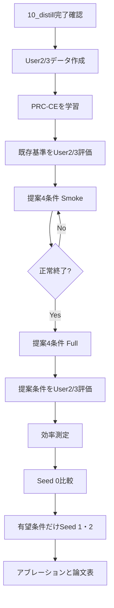
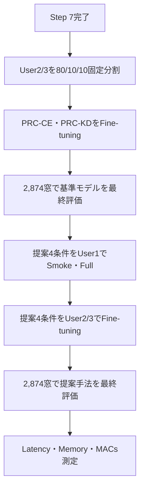

# SHL-2023 TGEC実験ロードマップ

> **確定方針（2026-09-04）**：PAMAP2など別データセットへの転移は行わない。一方、元論文と同様に、User1で蒸留したモデルをSHL-2023 User2/User3の22,985窓でFine-tuningし、2,873窓でモデル選択、独立した2,874窓で最終評価する。以下のSection 26以降が、この確定方針に基づくStep 7後の正式手順である。以前のUser2/User3全体への直接評価はzero-shot補助実験として扱う。

## 1. この文書の目的

この文書は、SENvT-Bを教師、PRCを生徒としたSHL-2023実験について、現在実行している標準蒸留の完了後から、User2/User3評価、提案手法TGECの検証、効率測定、複数Seed、論文用の結果整理までを順番に実行するための手順書である。

すべてのコマンドは、特に記載がない限り、次のプロジェクト直下で実行する。

```bash
cd "/home/jovyan/work/srv11/蒸留/EchoClassifier"
```

## 2. 今回検証する中心仮説

提案手法の中心は、重要でないパッチを単に削除することではない。

> SENvTが持つ時間方向の判断根拠を利用して重要パッチを選び、選ばれなかったパッチの情報も1個の要約トークンに凝縮してPRCへ渡すことで、計算量を減らしながら識別に必要な情報を残せるか。

したがって、最重要比較は `TG_SKIP_PRC` と `TGEC_PRC` である。両者の教師、選択数、PRC構造を揃え、省略情報を「捨てる」か「凝縮する」かだけを変える。

| 条件 | 経路決定 | PRCが処理する時間トークン | 省略情報 | 学習損失 |
|---|---|---:|---|---|
| PRC-CE | 選択なし | 31 | 省略なし | CE |
| PRC-KD | 選択なし | 31 | 省略なし | CE + logit KD |
| APS-CE | 生徒APS | 16 | 破棄 | CE |
| APS-KD | 生徒APS | 16 | 破棄 | CE + logit KD |
| TG-Skip | SENvT layer 1 Evidence normを蒸留 | 16 | 破棄 | CE + logit KD + route KL |
| TGEC | 同上 | 16 + 要約1 | 1トークンへ凝縮 | CE + logit KD + route KL + content loss |

TGECでは教師は学習中だけ使用する。User2/User3評価および実運用時には教師SENvTを使用しない。

## 3. SHファイルの役割一覧

| ファイル | 必須度 | いつ使うか | 目的 |
|---|---|---|---|
| `00_finetune_teacher_senvtB.sh` | 完了済み | 教師を作り直す場合のみ | SENvT-BをUser1でファインチューニングする |
| `10_distill_standard_students.sh` | 実行中・比較用 | 標準KDを追加・再開するとき | PRC、MLPMixer、ResNet、DeepConvLSTMなどへ通常のlogit KDを行う |
| `11_prepare_shl2023_user23.sh` | 必須・1回 | 評価の最初 | 公式validationのUser2/User3混合データを500サンプル窓へ変換する |
| `12_eval_checkpoint_user23.sh` | 補助 | 個別チェックポイントを評価するとき | 任意の生徒チェックポイントをUser2/User3混合データで評価する共通処理 |
| `13_eval_standard_kd_user23.sh` | 推奨 | 10_distill後 | 完了済みの標準KDモデルをUser2/User3で評価する |
| `14_train_prc_ce.sh` | 必須 | PRC-KDとの比較前 | 蒸留なしPRCを学習し、KDそのものの効果を測る |
| `15_eval_prc_ce_user23.sh` | 必須 | 14のfull終了後 | PRC-CEをUser2/User3で評価する |
| `19_after_10_distill.sh` | 任意・短縮用 | 10_distill直後 | 11とPRC標準KD評価を続けて実行する |
| `20_run_prc_condensation_study.sh` | 必須 | 基準評価後 | APS-CE、APS-KD、TG-Skip、TGECを学習する |
| `21_eval_prc_study_user23.sh` | 必須 | 20のfull終了後 | PRC-KDと提案関連4条件をUser2/User3でまとめて評価する |
| `22_profile_prc_study.sh` | 必須 | 全学習終了後 | 推論時間、ピークGPUメモリ、処理トークン数、支配的MACsを測る |

## 4. 実験全体の実行順



---

## 5. Step 0：配置と実行前検査

完成版ZIPをプロジェクト直下へ置き、展開する。

```bash
cd "/home/jovyan/work/srv11/蒸留/EchoClassifier"
unzip -o tgtec_server_complete_20260904.zip -d .
```

構文検査を行う。

```bash
python -m py_compile \
  main.py \
  engine.py \
  loss_func.py \
  datasets.py \
  models/TeacherGuidedEvidenceCondensation.py \
  models/senvt_adapters.py

bash -n scripts/shl2023_senvt_kd/*.sh
```

新モデルと損失のテンソル入出力、逆伝播を確認する。

```bash
python scripts/shl2023_senvt_kd/00_smoke_test_tgec.py
```

`aps`、`teacher_skip`、`tgec`の3行がすべて `[OK]` なら次へ進む。このテストは本データで精度を測るものではなく、モデルと損失が接続でき、routerへ勾配が届くことを確認するもの。

---

## 6. Step 1：10_distillの完了状態を確認する

現在の標準KD実験結果を確認する。

```bash
find experiments/shl2023_senvt_kd/student_distillation/standard_kd \
  -maxdepth 2 \
  -name summary.json \
  -print
```

特にPRCについて次が存在することを確認する。

```text
experiments/shl2023_senvt_kd/student_distillation/standard_kd/PRC_seed0/best_checkpoint.pth
experiments/shl2023_senvt_kd/student_distillation/standard_kd/PRC_seed0/summary.json
```

### 10_distillを再開する場合

途中で止まったモデルがある場合だけ実行する。

```bash
RESUME_PARTIAL=1 \
bash scripts/shl2023_senvt_kd/10_distill_standard_students.sh full all
```

PRC、MLPMixerなど必要なモデルが完了しているなら、10を最初から再実行する必要はない。ResNetとDeepConvLSTMは他アーキテクチャとの参考比較にはなるが、TGECの中心仮説を検証するための必須条件ではない。

---

## 7. Step 2：User2/User3混合評価データを作る

### なぜ行うか

User1の学習データをランダムに9:1分割したvalidationだけでは、未知利用者への一般化を確認できない。公式SHL-2023 validationはUser2/User3の混合なので、学習に使用していない利用者に対する評価に使う。

### 実行コマンド

```bash
bash scripts/shl2023_senvt_kd/11_prepare_shl2023_user23.sh
```

### 入力

```text
dataset/SHL_2023/validate/Hips/Acc.txt
dataset/SHL_2023/validate/Hips/Label.txt
```

### 出力

```text
dataset/2023_processed_user23/100hz_5.0s_overlap0.0s/Hips_Acc.npy
dataset/2023_processed_user23/100hz_5.0s_overlap0.0s/Hips_Label.npy
```

### 成功条件

```text
acc shape: (N, 3, 500)
label shape: (N,)
label values: [1, 2, 3, 4, 5, 6, 7, 8]
counts_match: True
```

このデータには窓単位のユーザーIDがないため、User2とUser3を個別評価するのではなく、User2/User3混合のcross-user評価として扱う。

---

## 8. Step 3：PRC-CE基準を作る

### なぜ行うか

PRC-KDだけでは、精度がPRCそのものによるものか、SENvTからの通常KDによるものか区別できない。蒸留なしPRC-CEを用意し、`PRC-CE vs PRC-KD`で通常KDの効果を測る。

### まず1 epoch確認

```bash
bash scripts/shl2023_senvt_kd/14_train_prc_ce.sh smoke
```

### 問題なければ100 epoch

```bash
bash scripts/shl2023_senvt_kd/14_train_prc_ce.sh full
```

途中停止から再開する場合：

```bash
RESUME_PARTIAL=1 \
bash scripts/shl2023_senvt_kd/14_train_prc_ce.sh full
```

### 出力

```text
experiments/shl2023_senvt_kd/student_baseline/PRC_ce_seed0/
```

---

## 9. Step 4：既存基準モデルをUser2/User3でzero-shot評価する（補助実験）

### 9.1 PRC-CEの評価

```bash
bash scripts/shl2023_senvt_kd/15_eval_prc_ce_user23.sh
```

### 9.2 PRC標準KDの評価

```bash
bash scripts/shl2023_senvt_kd/13_eval_standard_kd_user23.sh PRC
```

### 9.3 完了済み標準KDモデルをまとめて評価する場合

```bash
bash scripts/shl2023_senvt_kd/13_eval_standard_kd_user23.sh all_completed
```

`all_completed`では、チェックポイントが存在するPRC、PRC-LRGR、APS-LRGR、Transformer、MLPMixer、ResNet、DeepConvLSTMを評価し、未完了モデルはスキップする。

この一括評価を行う理由は、提案手法の主比較ではなく「TGECが一般的な軽量時系列モデルに対してどの位置にいるか」を論文の比較表に示すためである。時間が足りなければ、まずPRCだけでよい。

### 9.4 個別チェックポイントを直接評価する場合

`12_eval_checkpoint_user23.sh`は共通評価用の補助SHである。

```bash
bash scripts/shl2023_senvt_kd/12_eval_checkpoint_user23.sh \
  PRC \
  experiments/shl2023_senvt_kd/student_distillation/standard_kd/PRC_seed0/best_checkpoint.pth \
  prc_kd_seed0
```

### 9.5 19_after_10_distill.shについて

```bash
bash scripts/shl2023_senvt_kd/19_after_10_distill.sh
```

これは次の2処理を続けて行う短縮用SHである。

1. `11_prepare_shl2023_user23.sh`
2. `13_eval_standard_kd_user23.sh PRC`

すでにStep 2とPRC-KD評価を個別に実行済みなら、19は実行しなくてよい。重複実行を避けるための便利用スクリプトであり、独立した実験条件ではない。

---

## 10. Step 5：提案関連4条件をSmoke実行する

### なぜ行うか

教師の中間特徴を取り出すTG-Skip/TGECは、通常KDより処理が複雑である。100 epochを始める前に、損失、勾配、チェックポイント保存、パッチ数が正しいかを1 epochで確認する。

```bash
bash scripts/shl2023_senvt_kd/20_run_prc_condensation_study.sh smoke all
```

個別に試すこともできる。

```bash
bash scripts/shl2023_senvt_kd/20_run_prc_condensation_study.sh smoke aps_ce
bash scripts/shl2023_senvt_kd/20_run_prc_condensation_study.sh smoke aps_kd
bash scripts/shl2023_senvt_kd/20_run_prc_condensation_study.sh smoke tg_skip
bash scripts/shl2023_senvt_kd/20_run_prc_condensation_study.sh smoke tgec
```

### 成功確認

- 全条件が1 epoch終了する
- `loss`、`route_loss`、`content_loss`にNaN/Infがない
- TG-Skip/TGECで教師チェックポイントが145テンソル程度読み込まれる
- `keep_count=16`
- `summary.json`と`best_checkpoint.pth`が生成される
- TGECでのみ`content_loss`が出る

Smoke精度は最終比較には使用しない。

---

## 11. Step 6：提案関連4条件をFull実行する

```bash
bash scripts/shl2023_senvt_kd/20_run_prc_condensation_study.sh full all
```

実行順は次の通り。

```text
APS-CE → APS-KD → TG-Skip → TGEC
```

出力先：

```text
experiments/shl2023_senvt_kd/student_distillation/prc_condensation/
├── aps_ce_seed0/
├── aps_kd_seed0/
├── tg_skip_seed0/
└── tgec_seed0/
```

中断時：

```bash
RESUME_PARTIAL=1 \
bash scripts/shl2023_senvt_kd/20_run_prc_condensation_study.sh full all
```

完了済み条件には`summary.json`があるため自動スキップされる。`FORCE=1`は既存結果を上書きする可能性があるため、通常は使用しない。

---

---

## 11.5 Step 6.5：SENvTのどの層から教師情報を取得するか検証する

### なぜここで行うか

TG-SkipとTGECでは、SENvT-Bのencoder layer 1（0始まり）から時間方向の教師情報を取得している。論文中でLayer 1を恣意的に選んだように見せないため、ファインチューニング済み教師と、User1内の固定validation indicesを用いて全12層を同一条件で比較する。

この診断は学習条件を変更する実験ではない。Step 6で得たモデルを作り直さず、論文中でLayer 1の選択理由を示す補助解析である。GPU負荷が学習時間やメモリ測定へ影響しないよう、Step 6の学習プロセスが終了してから実行する。

### 比較する教師信号

単純なAttention重みだけでなく、TGECが実際にroute教師として用いるCLSから各時刻へのAttention×Value寄与を計算する。layer \(\ell\) の時刻 \(t\) に対する寄与を

\[
g_t^{(\ell)} = W_O^{(\ell)}\left[
a_{\mathrm{CLS},t}^{(\ell,1)}v_t^{(\ell,1)};\ldots;
a_{\mathrm{CLS},t}^{(\ell,H)}v_t^{(\ell,H)}
\right]
\]

とし、16時刻ずつまとめた生徒パッチ \(i\) の教師情報を

\[
G_i^{(\ell)}=\sum_{t\in P_i}g_t^{(\ell)},\qquad
q_i^{(\ell)}=
\frac{\lVert G_i^{(\ell)}\rVert_2}
{\sum_j\lVert G_j^{(\ell)}\rVert_2}
\]

として求める。この \(q^{(\ell)}\) は現在のTGEC実装と同じ31パッチ分布である。

主指標は、各サンプルで上位16パッチが保持する教師情報量

\[
M_{16}^{(\ell)}=\sum_{i\in\operatorname{Top16}(q^{(\ell)})}q_i^{(\ell)}
\]

である。一様分布なら基準値は \(16/31\simeq0.516\) となる。これに加えて、正規化エントロピーと時間トークン間のばらつきを確認し、後段層で時間差が消失していないかを調べる。

### 実行

```bash
bash scripts/shl2023_senvt_kd/20b_analyze_senvt_layers.sh
```

最初に軽く確認したい場合：

```bash
LAYER_ANALYSIS_SAMPLES=40 \
LAYER_ANALYSIS_BATCH_SIZE=4 \
bash scripts/shl2023_senvt_kd/20b_analyze_senvt_layers.sh
```

論文用の正式結果では既定の512サンプルを使う。512サンプルは固定validation indicesからクラス層化抽出され、seed 0で再現可能である。

### 出力

```text
experiments/shl2023_senvt_kd/results/layer_selection/
├── 01_layer_selection.png
├── 01_layer_selection.pdf
├── 02_layer_patch_heatmap.png
├── 02_layer_patch_heatmap.pdf
├── 03_sample_layer_heatmap.png
├── 03_sample_layer_heatmap.pdf
├── senvt_layer_metrics.csv
├── senvt_layer_diagnostics.json
├── senvt_layer_sample_metrics.npz
└── analysis_stdout.log
```

論文の本文では原則として`01_layer_selection.pdf`を使う。これは各層のTop-16 mass、エントロピー、時間トークンのばらつきを一枚で示す。`02_layer_patch_heatmap.pdf`は層ごとの時間位置分布、`03_sample_layer_heatmap.pdf`はLayer 1の優位性が一部サンプルだけで生じていないかを確認する補助図である。

### 採用判断

`senvt_layer_diagnostics.json`で次を確認する。

```json
"configured_tgec_layer": 1,
"empirical_best_layer_by_mean_topk_mass": 1,
"configured_layer_matches_empirical_best": true
```

`true`なら、Layer 1は全層中でTop-16に教師情報が最も集まり、かつ後段のような時間表現の崩壊が起きる前の層として採用した、と説明できる。ただし、この解析だけでLayer 1が分類精度も必ず最良とは断定しない。最終的な頑健性は後の`teacher_layer = 0, 1, 2`アブレーションで確認する。

もしempirical bestがLayer 1以外なら、結果を隠してLayer 1を正当化せず、TGECのFull結果を維持したまま「事前のローカル解析でLayer 1を固定した」と記述するか、上位層について小規模アブレーションを追加してから設計を確定する。

---

## 12. Step 7：提案関連条件をUser2/User3でzero-shot評価する（補助実験）

```bash
bash scripts/shl2023_senvt_kd/21_eval_prc_study_user23.sh
```

このSHは、存在するチェックポイントについて次をまとめて評価する。

1. PRC-KD
2. APS-CE
3. APS-KD
4. TG-Skip
5. TGEC

評価結果は次へ保存される。

```text
experiments/shl2023_senvt_kd/heldout_evaluation/user23_mixed/
```

### 見るべき比較

| 比較 | 分かること |
|---|---|
| PRC-CE vs PRC-KD | 通常logit KDの効果 |
| PRC-KD vs APS-KD | 31→16パッチ削減による精度・効率の変化 |
| APS-CE vs APS-KD | APSに対する通常KDの効果 |
| APS-KD vs TG-Skip | 教師の時間的Evidenceを経路学習へ使う効果 |
| TG-Skip vs TGEC | 捨てる代わりに凝縮する効果。最重要比較 |
| PRC-KD vs TGEC | フルパッチ基準に対する精度維持と効率改善 |

---

## 13. Step 8：推論効率を測定する

```bash
bash scripts/shl2023_senvt_kd/22_profile_prc_study.sh
```

### なぜ行うか

提案は精度だけでなく、PRCが処理する時系列ステップを減らすことで推論計算を減らす手法である。モデルサイズだけではこの効果を示せないため、レイテンシ、メモリ、MACsを測る。

### 出力

```text
experiments/shl2023_senvt_kd/results/prc_efficiency.json
```

### 記録される値

- 学習可能パラメータ数
- 推論レイテンシの平均・中央値
- ピークGPUメモリ
- PRCが処理したトークン数
- Reservoir反復に基づく支配的MACs推定値

想定トークン数は次の通り。

| モデル | 入力時間トークン | CLS/DISTを含む反復数 |
|---|---:|---:|
| PRC | 31 | 33 |
| APS-PRC | 16 | 18 |
| TG-Skip | 16 | 18 |
| TGEC | 16 + 要約1 | 19 |

TGECはTG-Skipより1回多く、フルPRCより14回少ない。この差が実測レイテンシでも現れるかを確認する。

---

## 14. Step 9：Seed 0の結果を整理する

最初に次の表を埋める。

| Method | User1 Val Acc | User2/3 Acc | Macro F1 | Tokens | Latency | Peak memory | MACs |
|---|---:|---:|---:|---:|---:|---:|---:|
| PRC-CE | | | | 31 | | | |
| PRC-KD | | | | 31 | | | |
| APS-CE | | | | 16 | | | |
| APS-KD | | | | 16 | | | |
| TG-Skip | | | | 16 | | | |
| TGEC | | | | 17 | | | |

Seed 0の段階で次を判断する。

1. TGECはTG-Skipより高精度か。
2. TGECはPRC-KDより処理時間・MACsを削減できているか。
3. TGECの精度低下がある場合、その低下は効率改善に対して許容可能か。
4. User1内validationだけでなくUser2/User3でも傾向が維持されるか。

TGECがTG-Skipを上回らない場合、すぐSeedを増やすのではなく、summary tokenの作り方、content loss、route lossが実際に学習されているかを先に調べる。

---

## 15. Step 10：有望条件だけ複数Seedを実行する

論文ではSeed 0だけよりも、少なくとも3 Seedの平均と標準偏差が望ましい。ただし全比較モデルを再実行する必要はない。

### 最低限の複数Seed

```text
PRC-KD
TG-Skip
TGEC
```

余裕があればAPS-KDを追加する。

```text
seed = 0, 1, 2
```

各Seedではデータ分割、Reservoir初期値、router初期値が変わる。`config.sh`の`SEED`を書き換える場合は、実行前後で必ず値を記録し、出力ディレクトリの`seedN`と一致させる。

最終表では次の形式で示す。

```text
Accuracy = 平均 ± 標準偏差
Macro F1 = 平均 ± 標準偏差
Latency = 平均 ± 標準偏差
```

---

## 16. Step 11：アブレーション実験

TGECのSeed 0結果が有望な場合にのみ実行する。優先順位は次の通り。

1. 凝縮あり／なし：TG-Skip vs TGEC
2. `keep_ratio = 0.25, 0.5, 0.75`
3. `teacher_layer = 0, 1, 2`
4. `route_weight`の比較
5. `content_weight`の比較
6. meanのみ、mean+RMS、別の要約器の比較

最初から全組合せを回すと実験数が急増する。まずlayer 1、keep ratio 0.5を固定して仮説を成立させ、その後に必要な範囲だけ広げる。

---

## 17. ResNet・DeepConvLSTMは必要か

### 現時点の結論

- 提案手法の成立確認には必須ではない。
- すでに標準KDが完了しているならUser2/User3評価だけ行う価値がある。
- TGECをResNetやDeepConvLSTMへ組み込む必要は現時点ではない。

理由は、TGECがPRCの逐次Reservoir処理回数を減らすことを狙った手法だからである。異なる内部構造へ無理に実装すると、「情報凝縮の効果」と「モデル構造の違い」が混ざる。

論文では次の二層で比較する。

1. **主比較**：PRC、APS-PRC、TG-Skip、TGEC
2. **参考比較**：MLPMixer、ResNet、DeepConvLSTMなど既存軽量モデル

---

## 18. 迷った場合の最短実行列

10_distillが終了している状態からは、次の順で進めればよい。

```bash
cd "/home/jovyan/work/srv11/蒸留/EchoClassifier"

# 1. User2/User3混合評価データを1回だけ作る
bash scripts/shl2023_senvt_kd/11_prepare_shl2023_user23.sh

# 2. 蒸留なしPRC基準を作る
bash scripts/shl2023_senvt_kd/14_train_prc_ce.sh smoke
bash scripts/shl2023_senvt_kd/14_train_prc_ce.sh full

# 3. PRC-CEとPRC-KDをcross-user評価する
bash scripts/shl2023_senvt_kd/15_eval_prc_ce_user23.sh
bash scripts/shl2023_senvt_kd/13_eval_standard_kd_user23.sh PRC

# 4. 提案関連4条件を1 epoch確認する
bash scripts/shl2023_senvt_kd/20_run_prc_condensation_study.sh smoke all

# 5. 提案関連4条件を100 epoch学習する
bash scripts/shl2023_senvt_kd/20_run_prc_condensation_study.sh full all

# 6. 提案関連条件をcross-user評価する
bash scripts/shl2023_senvt_kd/21_eval_prc_study_user23.sh

# 7. 推論効率を測定する
bash scripts/shl2023_senvt_kd/22_profile_prc_study.sh

# 8. 任意：完了済みの他モデルもcross-user評価する
bash scripts/shl2023_senvt_kd/13_eval_standard_kd_user23.sh all_completed
```

## 19. 最終的に論文で主張するために必要な証拠

最低限、次の4点が揃えば提案の評価を構成できる。

1. **精度**：TGECがTG-Skipより高く、省略情報の凝縮が有効。
2. **一般化**：User2/User3混合でも同じ傾向を確認。
3. **効率**：フルPRCよりトークン数、MACs、レイテンシを削減。
4. **再現性**：有望条件について3 Seedの平均・標準偏差を報告。

望ましい結果は、TGECがPRC-KDと同等に近い精度を維持しながら、フルPRCより少ないReservoir反復で推論でき、かつTG-Skipより高精度になることである。

---

## 20. 最終的な実験結果フォルダ構成

すべての実験が終了した時点では、`experiments/shl2023_senvt_kd`を「教師」「生徒の基準実験」「標準蒸留」「提案手法」「未知ユーザー評価」「効率・論文用集計」に分けて管理する。

```text
experiments/shl2023_senvt_kd/
│
├── teacher_finetune/
│   └── senvtB/
│       ├── best_checkpoint.pth
│       ├── checkpoint.pth
│       ├── log.txt
│       ├── summary.json
│       └── train_stdout.log
│
├── student_baseline/
│   ├── PRC_ce_seed0/
│   ├── PRC_ce_seed1/                    # 複数Seedを行う場合
│   └── PRC_ce_seed2/                    # 複数Seedを行う場合
│
├── student_distillation/
│   ├── standard_kd/
│   │   ├── PRC_seed0/
│   │   ├── PRC_LRGR_seed0/
│   │   ├── APS_LRGR_seed0/
│   │   ├── MLPMixer_seed0/
│   │   ├── Resnet_L_seed0/
│   │   ├── Resnet_M_seed0/
│   │   ├── Resnet_S_seed0/              # 任意
│   │   ├── DeepConvLSTM100_seed0/       # 任意
│   │   ├── DeepConvLSTM50_seed0/        # 任意
│   │   └── DeepConvLSTM25_seed0/        # 任意
│   │
│   └── prc_condensation/
│       ├── aps_ce_seed0/
│       ├── aps_kd_seed0/
│       ├── tg_skip_seed0/
│       └── tgec_seed0/
│
├── heldout_evaluation/
│   └── user23_mixed/
│       ├── PRC_ce_seed0/
│       ├── PRC_standard_kd_seed0/
│       ├── aps_ce/
│       ├── aps_kd/
│       ├── tg_skip/
│       ├── tgec/
│       ├── MLPMixer_standard_kd_seed0/  # 任意
│       ├── Resnet_L_standard_kd_seed0/  # 任意
│       └── Resnet_M_standard_kd_seed0/  # 任意
│
├── results/
│   ├── prc_efficiency.json
│   ├── experiment_summary.csv
│   ├── seed_summary.csv
│   ├── user23_comparison.csv
│   ├── efficiency_comparison.csv
│   └── figures/
│       ├── accuracy_comparison.png
│       ├── accuracy_latency_tradeoff.png
│       ├── token_reduction.png
│       └── seed_variance.png
│
├── data_splits/
│   ├── shl2023_distillation_split_indices.npz
│   ├── shl2023_analysis_samples.npz
│   └── shl2023_analysis_sample_manifest.json
│
├── inspect/
│   ├── shl_data_summary.txt
│   └── shl_alignment_label_summary.txt
│
└── logs/
    ├── standard_kd_prc.log
    ├── prc_condensation.log
    └── user23_evaluation.log
```

`Resnet_S`とDeepConvLSTMは、TGECの中心仮説を検証するための必須条件ではない。必要になった時点で`10_distill_standard_students.sh`を再実行して追加できるため、上の構成では任意としている。Transformerも既存結果を削除する必要はないが、最終比較表へ必ず掲載する必要はない。

## 21. 各主要フォルダの役割

### 21.1 `teacher_finetune/`

ファインチューニング済みSENvT-Bを保存する。通常KD、TG-Skip、TGECで同じ`best_checkpoint.pth`を利用する。教師を作り直さない限り、再学習や上書きを行わない。

### 21.2 `student_baseline/`

教師を使わないCE学習の結果を保存する。最低限必要なのは`PRC_ce_seed0`であり、`PRC-CE vs PRC-KD`によって通常KDの効果を測る。

### 21.3 `student_distillation/standard_kd/`

`10_distill_standard_students.sh`による既存モデルへの通常logit KD結果を保存する。TGECの直接的な提案比較ではなく、既存アーキテクチャに対する位置づけを示す参考比較である。

### 21.4 `student_distillation/prc_condensation/`

今回の研究の中心となる実験結果を保存する。

| フォルダ | 内容 | 検証目的 |
|---|---|---|
| `aps_ce_seed0` | 通常APS、教師なし | パッチ削減単体の効果 |
| `aps_kd_seed0` | 通常APS＋logit KD | 通常KDを加える効果 |
| `tg_skip_seed0` | 教師誘導選択＋省略情報破棄 | 教師から選択方法を学ぶ効果 |
| `tgec_seed0` | 教師誘導選択＋情報凝縮 | 省略情報を凝縮して残す効果 |

最重要比較は`tg_skip_seed0`と`tgec_seed0`である。

### 21.5 `heldout_evaluation/user23_mixed/`

User1で学習したチェックポイントを、公式validationのUser2/User3混合データで評価した結果を保存する。ここにはモデル学習用チェックポイントではなく、`eval_stdout.log`、評価値、完了マーカーを置く。

### 21.6 `results/`

各実験フォルダの結果を論文用に統合する。チェックポイントそのものではなく、比較CSV、効率JSON、平均・標準偏差、図を保存する。

### 21.7 `data_splits/`

User1内のtrain/validation分割や40サンプル診断に使ったインデックスを保存する。同一条件を再現するために削除しない。

### 21.8 `inspect/`

AccとLabelの対応、ラベル分布、前処理後shapeなど、データセット検査結果を保存する。論文の実験設定を記述するときの根拠にもなる。

### 21.9 `logs/`

`nohup`やバックグラウンド実行時のターミナル出力を保存する。各実験フォルダ内の`log.txt`はepoch別数値、`logs/*.log`は標準出力全体という役割に分ける。

## 22. 各学習結果フォルダの標準形

各学習フォルダは、正常終了後に次の構成になることが望ましい。

```text
tgec_seed0/
├── best_checkpoint.pth
├── checkpoint.pth
├── log.txt
├── summary.json
└── train_stdout.log
```

| ファイル | 用途 |
|---|---|
| `best_checkpoint.pth` | validation精度が最も高かったモデル。最終評価に使用する |
| `checkpoint.pth` | 最後に完了したepoch。中断後の再開に使用する |
| `log.txt` | epochごとの損失、精度、F1、メモリなど |
| `summary.json` | 実験設定と最終結果。正常完了の判定にも使用する |
| `train_stdout.log` | ターミナルに表示された学習ログ全体 |

### 完了状態の判定

| 状態 | 判定 |
|---|---|
| 正常完了 | `summary.json`がある |
| 途中停止 | `checkpoint.pth`はあるが`summary.json`がない |
| 未実行 | 実験フォルダまたは`checkpoint.pth`がない |

途中停止した`20_run_prc_condensation_study.sh`は次で再開する。

```bash
RESUME_PARTIAL=1 \
bash scripts/shl2023_senvt_kd/20_run_prc_condensation_study.sh full all
```

標準KDの途中モデルは次で再開する。

```bash
RESUME_PARTIAL=1 \
bash scripts/shl2023_senvt_kd/10_distill_standard_students.sh full all
```

## 23. Smoke結果の扱い

Smoke実験では次のようなフォルダが生成される。

```text
student_distillation/prc_condensation/
├── aps_ce_seed0_smoke/
├── aps_kd_seed0_smoke/
├── tg_skip_seed0_smoke/
└── tgec_seed0_smoke/
```

これは実装と入出力を確認するための1 epoch実験であり、論文の精度比較には使用しない。削除せず記録として残してもよいが、`results/`へ集計するときは`*_smoke`を除外する。

## 24. 論文のために最低限必要な結果構成

TGECの中心仮説だけを検証する場合、最低限次が揃えばよい。

```text
experiments/shl2023_senvt_kd/
├── teacher_finetune/
│   └── senvtB/
├── student_baseline/
│   └── PRC_ce_seed0/
├── student_distillation/
│   ├── standard_kd/
│   │   └── PRC_seed0/
│   └── prc_condensation/
│       ├── aps_ce_seed0/
│       ├── aps_kd_seed0/
│       ├── tg_skip_seed0/
│       └── tgec_seed0/
├── heldout_evaluation/
│   └── user23_mixed/
│       ├── PRC_ce_seed0/
│       ├── PRC_standard_kd_seed0/
│       ├── aps_ce/
│       ├── aps_kd/
│       ├── tg_skip/
│       └── tgec/
└── results/
    ├── experiment_summary.csv
    ├── user23_comparison.csv
    ├── prc_efficiency.json
    └── figures/
```

MLPMixer、ResNet、DeepConvLSTMは、この中心構成に対する追加の参考比較として扱う。

## 25. 現在地点からフォルダが増える順番

現在の`standard_kd/`実験からは、次の順番で結果が増えていく。

```text
現在
└── student_distillation/standard_kd/

次：PRCの蒸留なし基準
└── student_baseline/PRC_ce_seed0/

次：提案関連4条件
└── student_distillation/prc_condensation/
    ├── aps_ce_seed0/
    ├── aps_kd_seed0/
    ├── tg_skip_seed0/
    └── tgec_seed0/

学習後：未知ユーザー評価
└── heldout_evaluation/user23_mixed/

最後：論文用集計
└── results/
```

最終的には、`student_distillation/`の個別実験結果を`heldout_evaluation/`で未知ユーザー評価し、その数値を`results/`へ集約する、という流れになる。

---

## 26. Step 7完了後の正式な実行順（元論文準拠）

現在までに実行したUser2/User3全28,732窓への直接評価は、追加学習なしのzero-shot補助結果である。元論文準拠の主実験は、ここから次の順で進める。



### 26.1 User2/User3の固定分割を作成

```bash
cd "/home/jovyan/work/srv11/蒸留/EchoClassifier"
bash scripts/shl2023_senvt_kd/16_prepare_user23_downstream_split.sh
```

出力：

```text
experiments/shl2023_senvt_kd/data_splits/
├── shl2023_user23_downstream_split_indices.npz
└── shl2023_user23_downstream_split_indices.json
```

期待する件数：

| split | 件数 | 使用方法 |
|---|---:|---|
| train | 22,985 | Fine-tuningの重み更新 |
| validation | 2,873 | best checkpoint選択 |
| test | 2,874 | 最終評価のみ |

分割ファイルは全モデル・全手法で共通利用し、test indexは学習とモデル選択に使用しない。

### 26.2 PRC基準2条件をSmoke Fine-tuning

```bash
bash scripts/shl2023_senvt_kd/18_finetune_prc_baselines_user23.sh smoke
```

対象：

1. User1でCE学習したPRC
2. User1でSENvTから蒸留したPRC

`--finetune`はモデル重みだけを読み込み、optimizer、scheduler、epochを引き継がない。User2/User3のFine-tuningはepoch 0から新しいoptimizerで始まる。

Smoke出力：

```text
experiments/shl2023_senvt_kd/student_finetune/user23/
├── PRC_ce_seed0_smoke/
└── PRC_kd_seed0_smoke/
```

### 26.3 PRC基準2条件をFull Fine-tuning

Smokeでエラー、NaN、チェックポイント不整合がなければ実行する。

```bash
bash scripts/shl2023_senvt_kd/18_finetune_prc_baselines_user23.sh full
```

途中停止時：

```bash
RESUME_PARTIAL=1 \
bash scripts/shl2023_senvt_kd/18_finetune_prc_baselines_user23.sh full
```

Full出力：

```text
experiments/shl2023_senvt_kd/student_finetune/user23/
├── PRC_ce_seed0/
│   ├── best_checkpoint.pth
│   ├── checkpoint.pth
│   ├── log.txt
│   └── summary.json
└── PRC_kd_seed0/
    ├── best_checkpoint.pth
    ├── checkpoint.pth
    ├── log.txt
    └── summary.json
```

### 26.4 基準モデルをheld-out testで評価

`24_eval_finetuned_models_user23_test.sh`は存在するFine-tuning済みモデルだけを評価し、未完成条件をスキップする。そのため、基準2条件だけが完成した時点でも実行できる。

```bash
bash scripts/shl2023_senvt_kd/24_eval_finetuned_models_user23_test.sh
```

出力：

```text
experiments/shl2023_senvt_kd/heldout_evaluation/user23_test/
├── PRC_ce_seed0/
│   ├── evaluation_summary.json
│   └── eval_stdout.log
└── PRC_kd_seed0/
    ├── evaluation_summary.json
    └── eval_stdout.log
```

ここでPRC-CEとPRC-KDが正常にFine-tuningでき、2,874窓だけが評価されていることを確認してから提案手法へ進む。

### 26.5 提案4条件をUser1で学習

```bash
bash scripts/shl2023_senvt_kd/20_run_prc_condensation_study.sh smoke all
bash scripts/shl2023_senvt_kd/20_run_prc_condensation_study.sh full all
```

User1学習後の出力：

```text
experiments/shl2023_senvt_kd/student_distillation/prc_condensation/
├── aps_ce_seed0/
├── aps_kd_seed0/
├── tg_skip_seed0/
└── tgec_seed0/
```

### 26.6 提案4条件をUser2/User3でSmoke Fine-tuning

```bash
bash scripts/shl2023_senvt_kd/23_finetune_prc_study_user23.sh smoke
```

Smoke出力：

```text
experiments/shl2023_senvt_kd/student_finetune/user23/
├── aps_ce_seed0_smoke/
├── aps_kd_seed0_smoke/
├── tg_skip_seed0_smoke/
└── tgec_seed0_smoke/
```

User2/User3 Fine-tuningでは教師SENvTを使わず、User1学習済みの重みを初期値としてCEで更新する。TG-Skip/TGECのrouterと凝縮器も生徒モデルの一部として更新する。

### 26.7 提案4条件をUser2/User3でFull Fine-tuning

```bash
bash scripts/shl2023_senvt_kd/23_finetune_prc_study_user23.sh full
```

途中停止時：

```bash
RESUME_PARTIAL=1 \
bash scripts/shl2023_senvt_kd/23_finetune_prc_study_user23.sh full
```

Full出力：

```text
experiments/shl2023_senvt_kd/student_finetune/user23/
├── aps_ce_seed0/
├── aps_kd_seed0/
├── tg_skip_seed0/
└── tgec_seed0/
```

### 26.8 全6条件をheld-out testで最終評価

```bash
bash scripts/shl2023_senvt_kd/24_eval_finetuned_models_user23_test.sh
```

最終評価フォルダ：

```text
experiments/shl2023_senvt_kd/heldout_evaluation/user23_test/
├── PRC_ce_seed0/
├── PRC_kd_seed0/
├── aps_ce_seed0/
├── aps_kd_seed0/
├── tg_skip_seed0/
└── tgec_seed0/
```

各フォルダの`evaluation_summary.json`には、2,874窓に対するAccuracy、Macro Precision、Macro Recall、Macro F1などが保存される。

### 26.9 効率測定

```bash
bash scripts/shl2023_senvt_kd/22_profile_prc_study.sh
```

精度はFine-tuning後のheld-out test、効率は教師を含まない生徒単体の推論として報告する。

## 27. 追加されたコードとSH

| ファイル | 役割 |
|---|---|
| `prepare_user23_downstream_split.py` | 再現可能な80/10/10分割を生成・検証する |
| `16_prepare_user23_downstream_split.sh` | 分割生成の入口 |
| `17_finetune_checkpoint_user23.sh` | 任意モデル・任意チェックポイントの共通Fine-tuning処理 |
| `18_finetune_prc_baselines_user23.sh` | PRC-CEとPRC-KDを順番にFine-tuningする |
| `23_finetune_prc_study_user23.sh` | APS-CE、APS-KD、TG-Skip、TGECをFine-tuningする |
| `24_eval_finetuned_models_user23_test.sh` | Fine-tuning済み6条件を固定testだけで評価する |

`datasets.py`には次を追加した。

| data mode | 内容 |
|---|---|
| `SHL2023_user23` | 全28,732窓のzero-shot補助評価 |
| `SHL2023_user23_finetune` | 固定train/validationを返す |
| `SHL2023_user23_test` | 固定2,874 testだけを返す |

`main.py`には`--finetune`と`--split-indices`を追加した。`--finetune`は重みだけを初期化に使い、`--resume`は同じ実験のoptimizer・scheduler・epochを含む再開に使う。この2つを区別することで、User1学習のoptimizer状態がUser2/User3へ混入するのを防ぐ。

## 28. 最終出力フォルダの確定形

```text
experiments/shl2023_senvt_kd/
├── teacher_finetune/
│   └── senvtB/
├── student_baseline/
│   └── PRC_ce_seed0/
├── student_distillation/
│   ├── standard_kd/
│   │   └── PRC_seed0/
│   └── prc_condensation/
│       ├── aps_ce_seed0/
│       ├── aps_kd_seed0/
│       ├── tg_skip_seed0/
│       └── tgec_seed0/
├── student_finetune/
│   └── user23/
│       ├── PRC_ce_seed0/
│       ├── PRC_kd_seed0/
│       ├── aps_ce_seed0/
│       ├── aps_kd_seed0/
│       ├── tg_skip_seed0/
│       └── tgec_seed0/
├── heldout_evaluation/
│   ├── user23_mixed/                   # zero-shot補助結果
│   └── user23_test/                    # 元論文準拠の主結果
│       ├── PRC_ce_seed0/
│       ├── PRC_kd_seed0/
│       ├── aps_ce_seed0/
│       ├── aps_kd_seed0/
│       ├── tg_skip_seed0/
│       └── tgec_seed0/
├── data_splits/
│   ├── shl2023_distillation_split_indices.npz
│   └── shl2023_user23_downstream_split_indices.npz
└── results/
    ├── prc_efficiency.json
    ├── experiment_summary.csv
    ├── user23_test_comparison.csv
    └── figures/
```

`heldout_evaluation/user23_mixed`にある22.36%・24.84%は削除せずzero-shot補助結果として残し、元論文準拠の最終結果は`heldout_evaluation/user23_test`へ分離する。


## 1. Environment（conda）

### 1.1 env作成 + environment.yml 出力

```bash
conda create -n mfm311 python=3.11 -y && conda activate mfm311 && \
conda install -y numpy=1.25.2 && \
pip install huggingface-hub==0.24.0 transformers==4.33.3 momentfm==0.1.4 && \
conda env export > environment.yml
```

### 1.2 Jupyter kernel

```bash
(
set -e

if ! conda env list | grep -qE '^mfm311[[:space:]]'; then
  conda create -n mfm311 python=3.11 -y
fi

conda activate mfm311

conda install -y -c conda-forge numpy=1.25.2

unset PIP_EXTRA_INDEX_URL
export PIP_CONFIG_FILE=/dev/null

python -m pip install \
  torch==2.5.1 \
  torchvision==0.20.1 \
  --index-url https://download.pytorch.org/whl/cu121

python -m pip install \
  --index-url https://pypi.org/simple \
  huggingface-hub==0.24.0 \
  transformers==4.33.3 \
  momentfm==0.1.4 \
  pandas \
  scikit-learn \
  scipy \
  timm \
  ipykernel \
  psutil \
  thop \
  nvidia-ml-py \
  matplotlib

python -m ipykernel install \
  --user \
  --name mfm311 \
  --display-name "Python (mfm311)"

python -m pip check

python - <<'PY'
import torch
import torchvision
import numpy
import pandas
import sklearn
import scipy
import timm
import transformers
import psutil
import thop
import pynvml
import matplotlib
from momentfm import MOMENTPipeline

print()
print("========== Environment check ==========")
print("Python            : OK")
print("PyTorch           :", torch.__version__)
print("Torchvision       :", torchvision.__version__)
print("CUDA build        :", torch.version.cuda)
print("CUDA available    :", torch.cuda.is_available())

if torch.cuda.is_available():
    print("GPU               :", torch.cuda.get_device_name(0))
    x = torch.randn(2, 3, device="cuda")
    print("CUDA operation    :", (x @ x.T).shape, "OK")

print("NumPy             :", numpy.__version__)
print("Pandas            :", pandas.__version__)
print("Scikit-learn      :", sklearn.__version__)
print("SciPy             :", scipy.__version__)
print("timm              :", timm.__version__)
print("Transformers      :", transformers.__version__)
print("MOMENT            : import OK")
print("All imports       : OK")
print("=======================================")
PY

conda env export --no-builds > environment.yml
python -m pip freeze > requirements.txt

echo
echo "mfm311 environment setup completed."
echo "Saved environment.yml and requirements.txt"
)
```
